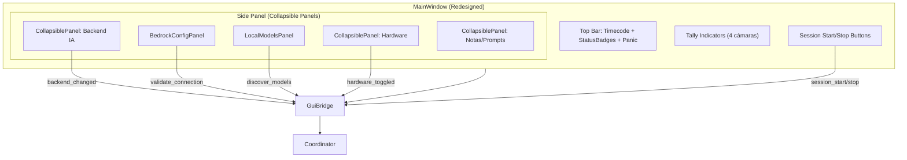
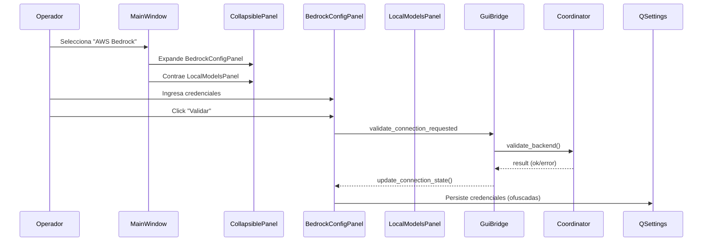

# Design Document: GUI Redesign

## Overview

Este diseño aborda el rediseño de la interfaz PyQt6 de Switch_bot para resolver cuatro problemas fundamentales: configuración de AWS Bedrock poco accesible, descubrimiento difícil de modelos locales, imposibilidad de operar sin hardware, y aplicación incompleta del design system Catppuccin Mocha.

La solución introduce nuevos widgets reutilizables (`CollapsiblePanel`, `StatusBadge`, `BedrockConfigPanel`, `LocalModelsPanel`, `HardwareSection`) que se integran en la `MainWindow` existente, reorganiza el layout según las zonas definidas en el design system, y añade persistencia de estado UI via `QSettings`. No se modifica la lógica de negocio ni la arquitectura `MainWindow → GuiBridge → Coordinator`.

### Decisiones Clave de Diseño

1. **CollapsiblePanel como widget genérico**: En lugar de usar `QToolBox` (que fuerza una UX de acordeón excluyente), se implementa un widget colapsable custom que permite múltiples paneles expandidos simultáneamente, con animación de 150ms ease-in-out.

2. **Mutual exclusion en credenciales Bedrock**: Los campos profile name y credenciales manuales se deshabilitan mutuamente con lógica reactiva basada en `textChanged`, no con radio buttons, para mantener la interfaz limpia.

3. **Hardware toggles como QCheckBox**: Los toggles ATEM/OBS se implementan con `QCheckBox` estándar estilizados, más intuitivos que switches custom para una audiencia broadcast.

4. **QSettings para persistencia**: Se usa `QSettings` con formato INI para persistir estado de paneles, toggles de hardware, y credenciales (secretos ofuscados via `QSettings` con scope de usuario, nunca en texto plano).

5. **StatusBadge compuesto**: Combina `StatusDot` existente con un `QLabel` en un layout horizontal, reutilizando el widget ya probado.

## Architecture



### Flujo de Datos



## Components and Interfaces

### 1. CollapsiblePanel (Nuevo Widget)

Widget genérico que envuelve cualquier contenido en un panel expandible/contraíble con animación.

```python
class CollapsiblePanel(QWidget):
    """Panel colapsable con animación de expansión/contracción.
    
    Signals:
        toggled(bool): Emitido cuando cambia el estado (True=expandido).
    """
    toggled = pyqtSignal(bool)
    
    def __init__(self, title: str, expanded: bool = False, parent=None): ...
    def is_expanded(self) -> bool: ...
    def set_expanded(self, expanded: bool, animate: bool = True): ...
    def set_content(self, widget: QWidget): ...
    def title(self) -> str: ...
```

**Comportamiento:**
- Header: barra clickable de máximo 36px con icono chevron rotable + título
- Contenido: widget hijo envuelto en `QWidget` con `setMaximumHeight` animado
- Animación: `QPropertyAnimation` en `maximumHeight`, 150ms, `QEasingCurve.InOutQuad`
- Estado colapsado: altura de contenido = 0 (solo header visible)

### 2. StatusBadge (Nuevo Widget)

Combina un `StatusDot` con texto descriptivo del estado.

```python
class BadgeState(Enum):
    CONNECTED = "connected"
    RECONNECTING = "reconnecting"
    DISCONNECTED = "disconnected"
    DISABLED = "disabled"

class StatusBadge(QWidget):
    """StatusDot + label de texto para mostrar estado de un servicio."""
    
    def __init__(self, label: str, state: BadgeState = BadgeState.DISCONNECTED, parent=None): ...
    def set_state(self, state: BadgeState): ...
    def state(self) -> BadgeState: ...
```

**Colores por estado:**
- `CONNECTED`: verde `#a6e3a1`, texto "Conectado"
- `RECONNECTING`: amarillo `#f9e2af`, texto "Reconectando..."
- `DISCONNECTED`: rojo `#f38ba8`, texto "Desconectado"
- `DISABLED`: gris `#585b70`, texto "No configurado"

### 3. BedrockConfigPanel (Nuevo Componente)

Panel de configuración de credenciales AWS Bedrock.

```python
class BedrockConfigPanel(QWidget):
    """Panel de configuración de credenciales AWS Bedrock.
    
    Signals:
        credentials_changed(): Emitido cuando cambian las credenciales.
        validate_requested(): Emitido al presionar Validar.
    """
    credentials_changed = pyqtSignal()
    validate_requested = pyqtSignal()
    
    def __init__(self, parent=None): ...
    def get_credentials(self) -> dict: ...
    def set_validation_state(self, state: BadgeState, message: str = ""): ...
    def set_validating(self, validating: bool): ...
    def load_settings(self, settings: QSettings): ...
    def save_settings(self, settings: QSettings): ...
```

**Campos:**
- AWS Access Key ID: `QLineEdit` (max 128 chars)
- AWS Secret Access Key: `QLineEdit` con `EchoMode.Password` + toggle visibility
- Región AWS: `QComboBox` con regiones estándar
- Profile Name: `QLineEdit` (max 64 chars, alternativa a credenciales manuales)

**Lógica de exclusión mutua:**
- Cuando `profile_name` tiene texto → deshabilita access_key y secret_key
- Cuando `access_key` o `secret_key` tiene texto → deshabilita profile_name

### 4. LocalModelsPanel (Nuevo Componente)

Panel de descubrimiento y selección de modelos locales.

```python
class LocalModelsPanel(QWidget):
    """Panel de descubrimiento de modelos locales (Ollama/llama.cpp).
    
    Signals:
        discover_requested(): Emitido al presionar Descubrir.
        runtime_changed(str): Emitido al cambiar el tipo de runtime.
        model_selected(str, str): Emitido (model_id, model_type).
    """
    discover_requested = pyqtSignal()
    runtime_changed = pyqtSignal(str)
    model_selected = pyqtSignal(str, str)
    
    def __init__(self, parent=None): ...
    def set_runtime(self, runtime: str): ...
    def populate_models(self, embeddings: list[dict], llms: list[dict]): ...
    def set_discovering(self, discovering: bool): ...
    def set_error(self, message: str): ...
    def set_status(self, count: int): ...
```

**Campos:**
- Runtime selector: `QComboBox` ["Ollama", "llama.cpp"]
- Botón "Descubrir Modelos" + botón refresh
- Embedding model: `QComboBox` mostrando "nombre (X.X GB)"
- LLM model: `QComboBox` mostrando "nombre (X.X GB)"
- StatusBadge con conteo de modelos

### 5. HardwareSection (Nuevo Componente)

Sección de configuración de hardware con toggles opcionales.

```python
class HardwareSection(QWidget):
    """Sección de configuración de hardware ATEM/OBS con toggles.
    
    Signals:
        atem_toggled(bool): Toggle ATEM cambiado.
        obs_toggled(bool): Toggle OBS cambiado.
        config_changed(): Algún campo de configuración cambió.
    """
    atem_toggled = pyqtSignal(bool)
    obs_toggled = pyqtSignal(bool)
    config_changed = pyqtSignal()
    
    def __init__(self, parent=None): ...
    def is_atem_enabled(self) -> bool: ...
    def is_obs_enabled(self) -> bool: ...
    def get_atem_ip(self) -> str: ...
    def get_obs_url(self) -> str: ...
    def get_output_dir(self) -> str: ...
    def get_video_mode(self) -> str: ...
    def validate_for_session(self) -> tuple[bool, str]: ...
    def load_settings(self, settings: QSettings): ...
    def save_settings(self, settings: QSettings): ...
```

**Layout:**
- Checkbox "Habilitar ATEM" + campo IP (disabled cuando toggle off)
- Checkbox "Habilitar OBS" + campo URL (disabled cuando toggle off)
- Output directory con browse button
- Video mode selector

### 6. MainWindow (Modificada)

La `MainWindow` existente se reorganiza para usar los nuevos componentes:

```python
class MainWindow(QMainWindow):
    # Nuevas señales
    hardware_config_changed = pyqtSignal()
    standalone_mode_active = pyqtSignal(bool)
    
    # Métodos nuevos/modificados
    def _build_top_bar(self, layout): ...      # Ahora incluye StatusBadges
    def _build_side_panel(self, layout): ...   # Usa CollapsiblePanels
    def _build_session_controls(self, layout): ...  # Movido a zona principal
    def set_standalone_mode(self, active: bool): ... 
    def save_ui_state(self): ...
    def restore_ui_state(self): ...
```

**Cambios en layout:**
- Zona principal (70%): Top Bar → Tally → Session Controls (visibles sin scroll)
- Panel lateral (30%): CollapsiblePanel(Backend) → CollapsiblePanel(Hardware) → CollapsiblePanel(Notas)
- Top Bar: Timecode | StatusBadges (IA, ATEM, OBS) | Session Status | Panic Button

### 7. GuiBridge (Extendido)

```python
class GuiBridge(QObject):
    # Nuevos métodos
    def _on_validate_bedrock(self): ...
    def _on_discover_models(self): ...
    def _on_hardware_toggled(self, service: str, enabled: bool): ...
    def update_service_status(self, service: str, state: BadgeState): ...
```

## Data Models

### UI State (QSettings)

```python
# Clave: "gui-redesign/v1"
UIState = {
    # Panel states
    "panels/backend_expanded": bool,      # default: True
    "panels/hardware_expanded": bool,     # default: True  
    "panels/notes_expanded": bool,        # default: False
    
    # Hardware toggles
    "hardware/atem_enabled": bool,        # default: False
    "hardware/obs_enabled": bool,         # default: False
    "hardware/atem_ip": str,              # default: ""
    "hardware/obs_url": str,              # default: "ws://localhost:4455"
    "hardware/output_dir": str,           # default: "./output"
    "hardware/video_mode": str,           # default: "1080p29.97 (Drop Frame)"
    
    # Backend IA
    "backend/type": str,                  # "bedrock" | "local"
    "backend/bedrock_region": str,        # default: "us-east-1"
    "backend/bedrock_profile": str,       # default: ""
    "backend/bedrock_access_key": str,    # default: ""
    "backend/bedrock_secret_key": str,    # OFUSCADO, nunca texto plano
    "backend/local_runtime": str,         # "ollama" | "llamacpp"
    "backend/local_embedding_model": str, # último seleccionado
    "backend/local_llm_model": str,       # último seleccionado
}
```

### Model Info (para LocalModelsPanel)

```python
@dataclass
class ModelInfo:
    """Información de un modelo local descubierto."""
    id: str               # e.g. "llama3:8b"
    name: str             # e.g. "Llama 3 8B"
    size_gb: float | None # e.g. 4.7, None si no disponible
    model_type: str       # "embedding" | "llm"
    
    def display_text(self) -> str:
        """Texto para mostrar en el dropdown."""
        if self.size_gb is not None:
            return f"{self.name} ({self.size_gb:.1f} GB)"
        return self.name
```

### Credential Storage

Las credenciales de AWS Secret Access Key se almacenan ofuscadas:
- Se usa `base64` encoding + inversión de bytes como ofuscación mínima
- **No es criptografía**, pero evita exposición en texto plano en archivos INI
- La seguridad real depende de los permisos del filesystem del usuario
- El AWS Profile Name es la alternativa recomendada (no requiere almacenar secretos)

```python
def obfuscate_secret(secret: str) -> str:
    """Ofusca un secreto para almacenamiento local."""
    return base64.b64encode(secret[::-1].encode()).decode()

def deobfuscate_secret(stored: str) -> str:
    """Desofusca un secreto almacenado."""
    return base64.b64decode(stored.encode()).decode()[::-1]
```


## Correctness Properties

*A property is a characteristic or behavior that should hold true across all valid executions of a system — essentially, a formal statement about what the system should do. Properties serve as the bridge between human-readable specifications and machine-verifiable correctness guarantees.*

### Property 1: Credential mutual exclusion

*For any* non-empty string entered in the profile name field, the manual credential fields (access key, secret key) SHALL be disabled; and *for any* non-empty string entered in either manual credential field, the profile name field SHALL be disabled. At no point can both input modes be simultaneously active.

**Validates: Requirements 1.4**

### Property 2: Secret obfuscation round-trip

*For any* valid string (non-empty, printable characters), applying `obfuscate_secret` followed by `deobfuscate_secret` SHALL produce a string identical to the original input.

**Validates: Requirements 1.5**

### Property 3: Model display text formatting

*For any* `ModelInfo` instance with a non-empty `name` and an optional `size_gb` value, `display_text()` SHALL contain the model name. If `size_gb` is not None, `display_text()` SHALL also contain the size formatted as `"(X.X GB)"`.

**Validates: Requirements 2.3**

### Property 4: Hardware session validation

*For any* combination of toggle states (`atem_enabled`, `obs_enabled`) and field values (`atem_ip`, `obs_url`), `validate_for_session()` SHALL return `(True, "")` if and only if every enabled service has a non-empty connection field. Specifically: if both toggles are disabled, validation always passes regardless of field content; if a toggle is enabled with an empty field, validation fails with an error message.

**Validates: Requirements 3.2, 3.8, 3.9**

### Property 5: UI state persistence round-trip

*For any* valid UI state (panel expanded/collapsed booleans, hardware toggle booleans, non-null string field values), saving to `QSettings` via `save_settings()` and then restoring via `load_settings()` SHALL produce a state equivalent to the original.

**Validates: Requirements 3.7, 5.7**

### Property 6: CollapsiblePanel toggle inverts state

*For any* initial expanded state (True or False) of a `CollapsiblePanel`, calling `set_expanded(not current_state)` SHALL result in `is_expanded()` returning the opposite of the initial state.

**Validates: Requirements 5.8**

### Property 7: StatusBadge state mapping correctness

*For any* `BadgeState` enum value, the StatusBadge SHALL map it to (a) the correct color from the design system COLORS dict (green for CONNECTED, yellow for RECONNECTING, red for DISCONNECTED, surface2 for DISABLED) and (b) a non-empty descriptive text string.

**Validates: Requirements 6.3, 6.6**

### Property 8: WCAG contrast ratio compliance

*For any* foreground/background color pair used in the theme for text rendering (text on base, text on surface0, text on surface1, subtext0 on base, cyan on mantle), the WCAG luminance contrast ratio SHALL be >= 4.5:1.

**Validates: Requirements 4.9**

## Error Handling

### Credenciales AWS

| Escenario | Comportamiento |
|-----------|---------------|
| Campos vacíos al validar | Mensaje inline: "Se requiere un profile name o credenciales manuales" |
| Timeout de validación (>10s) | StatusDot rojo + mensaje "No se pudo conectar dentro del tiempo límite" |
| Error de red/credenciales | StatusDot rojo + mensaje descriptivo del error AWS |
| Secret key corrupta en QSettings | Se borra el valor y se solicita reingreso |

### Descubrimiento de Modelos Locales

| Escenario | Comportamiento |
|-----------|---------------|
| Runtime no responde (timeout 10s) | Mensaje: "{runtime} no está disponible. Inicie el servicio." |
| Runtime responde con 0 modelos | Mensaje: "No se encontraron modelos instalados. Instale modelos antes de continuar." |
| Error de conexión refused | Mensaje: "{runtime} no está disponible. Verifique que el servicio está ejecutándose." |
| Modelo previamente seleccionado ya no existe | Se limpia la selección y se muestra warning |

### Hardware / Sesión

| Escenario | Comportamiento |
|-----------|---------------|
| Toggle activo con campo vacío | Impide inicio de sesión + mensaje "Campo requerido cuando {servicio} está habilitado" |
| Pérdida de conexión ATEM/OBS durante sesión | StatusBadge → RECONNECTING, no detiene la sesión |
| Error al guardar QSettings | Log warning, continúa operación sin persistencia |

### Paneles Colapsables

| Escenario | Comportamiento |
|-----------|---------------|
| Contenido excede espacio disponible | Panel lateral usa QScrollArea para scroll vertical |
| Animación interrumpida por click rápido | Se cancela la animación actual y se inicia la nueva dirección |

## Testing Strategy

### Enfoque Dual

Se utiliza una combinación de:
- **Property-based tests** (Hypothesis): Validan propiedades universales definidas en Correctness Properties
- **Unit tests** (pytest): Verifican ejemplos específicos, edge cases y comportamiento de integración
- **Smoke tests** (pytest): Verifican existencia y configuración básica de widgets

### Property-Based Tests (Hypothesis)

**Biblioteca**: [Hypothesis](https://hypothesis.readthedocs.io/) para Python

**Configuración**: Mínimo 100 iteraciones por propiedad (`@settings(max_examples=100)`)

**Propiedades a implementar:**

| # | Propiedad | Generador |
|---|-----------|-----------|
| 1 | Credential mutual exclusion | `st.text(min_size=1)` para strings no vacíos |
| 2 | Secret obfuscation round-trip | `st.text(alphabet=st.characters(whitelist_categories=('L','N','P','S')))` |
| 3 | Model display text formatting | `st.builds(ModelInfo, ...)` con nombre y size opcionales |
| 4 | Hardware session validation | `st.booleans()` para toggles + `st.text()` para fields |
| 5 | UI state persistence round-trip | `st.fixed_dictionaries(...)` con tipos correctos |
| 6 | CollapsiblePanel toggle | `st.booleans()` para estado inicial |
| 7 | StatusBadge state mapping | `st.sampled_from(BadgeState)` |
| 8 | WCAG contrast ratio | `st.sampled_from(color_pairs)` sobre pares del theme |

Cada test se etiqueta:
```python
# Feature: gui-redesign, Property 2: Secret obfuscation round-trip
@given(secret=st.text(min_size=1, alphabet=printable_chars))
@settings(max_examples=100)
def test_secret_obfuscation_roundtrip(secret):
    assert deobfuscate_secret(obfuscate_secret(secret)) == secret
```

### Unit Tests (pytest)

- **BedrockConfigPanel**: Validar UI states, botón toggle visibility, campo deshabilitación
- **LocalModelsPanel**: Verificar populate_models con datos concretos, error states
- **HardwareSection**: Toggle enable/disable de campos, standalone mode indicator
- **CollapsiblePanel**: Animación params, header click handler, initial states
- **MainWindow**: Layout structure, default panel states, session lock behavior

### Smoke Tests

- Verificar que todos los widgets interactivos tienen tooltips no vacíos
- Verificar que el stylesheet base contiene todos los selectores esperados
- Verificar estructura de layout (splitter sizes, panel order)
- Verificar que StatusBadges existen en la top bar

### Integration Tests

- Flujo completo: seleccionar backend → configurar → validar → iniciar sesión
- Persistencia end-to-end: configurar → cerrar → reabrir → verificar estado restaurado
- Descubrimiento de modelos con mock de Ollama API
