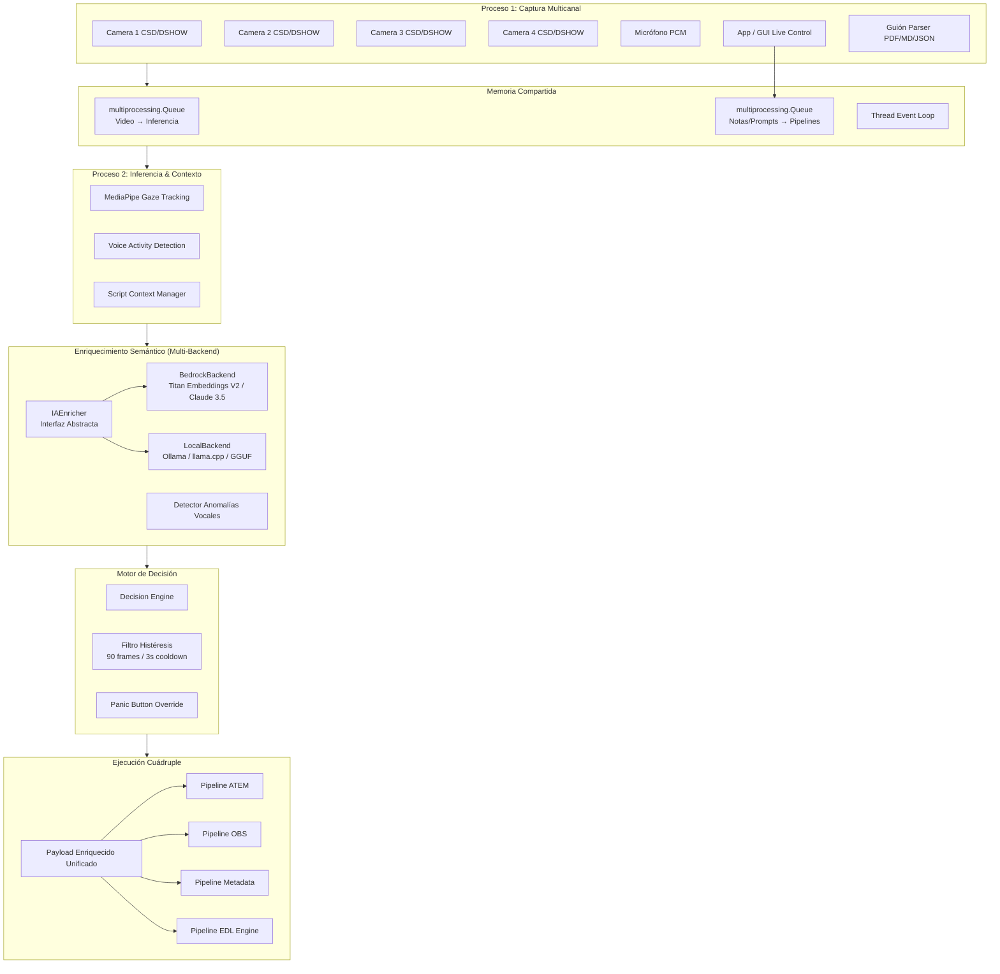
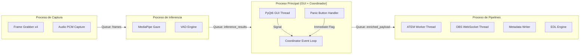
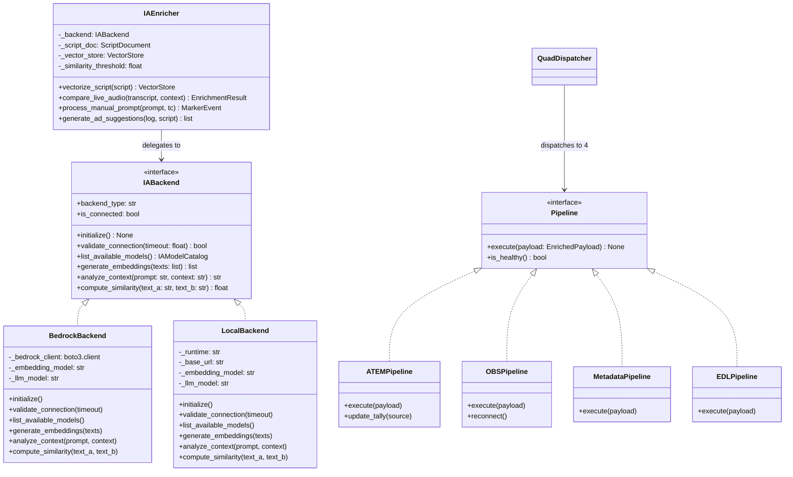
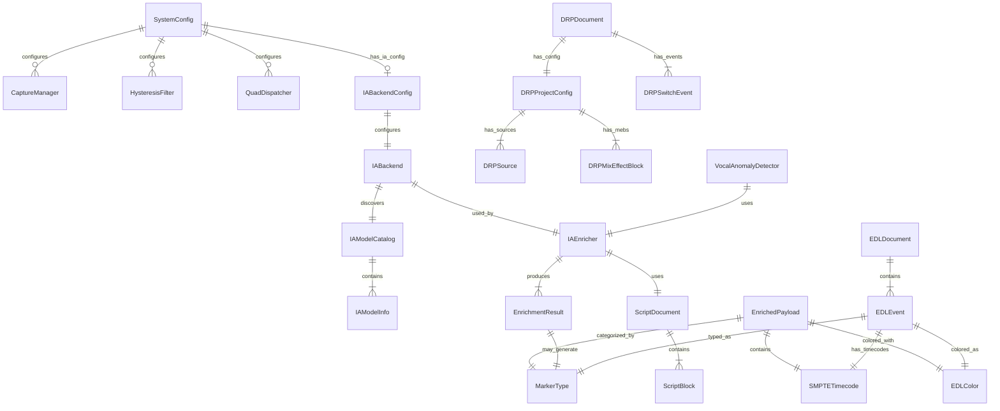

# Documento de Diseño Técnico — Switch_bot

## Overview

Switch_bot es un sistema de automatización de producción multicámara en tiempo real que integra captura de video, inferencia de visión artificial, detección de actividad vocal, enriquecimiento semántico por IA multi-backend y ejecución cuádruple paralela de pipelines. El sistema opera como un orquestador autónomo que toma decisiones de conmutación de cámara basándose en el análisis contextual del contenido en vivo comparado contra un guión pre-cargado.

El componente de enriquecimiento semántico (Enriquecedor_IA) abstrae múltiples backends de IA mediante un patrón Strategy, permitiendo al operador elegir entre AWS Bedrock (cloud) y modelos locales (Ollama, llama.cpp con modelos GGUF) según los recursos disponibles en su entorno.

### Objetivos de Diseño

1. **Latencia sub-frame**: Toda la cadena de procesamiento debe completarse dentro del frame time configurado (33.33 ms a 30 fps)
2. **Aislamiento de procesos**: Ningún bloqueo en inferencia, generación de archivos o red debe afectar la captura de video
3. **Ejecución cuádruple sincrónica**: Los 4 pipelines (ATEM, OBS, Metadata, EDL) reciben un payload unificado y se ejecutan en paralelo con tolerancia a fallas individuales
4. **Fidelidad de serialización**: Los formatos .drp y .edl deben garantizar round-trip sin pérdida de información
5. **Control humano**: El operador puede intervenir en cualquier momento mediante panic button, notas manuales o prompts de IA
6. **Agnóstico al backend de IA**: El sistema produce resultados con estructura idéntica independientemente del backend de IA utilizado (cloud o local)

### Stack Tecnológico

| Componente | Tecnología |
|---|---|
| Lenguaje | Python 3.11+ |
| Concurrencia | `multiprocessing` + `asyncio` + `threading` |
| GUI | PyQt6 / PySide6 |
| Visión | MediaPipe (gaze tracking) |
| Audio | WebRTC VAD / similar |
| Switcher HW | PyAtemMax (TCP async) |
| OBS | WebSocket / MCP Protocol |
| IA Cloud | AWS Bedrock (boto3) — Titan Embeddings V2, Claude 3.5 |
| IA Local | Ollama (HTTP API), llama.cpp (bindings), modelos GGUF |
| NLE Target | DaVinci Resolve (.drp, .edl) |
| Persistencia Config | JSON local (`~/.switch_bot/config.json`) |

---

## Architecture

### Diagrama de Arquitectura de Alto Nivel



### Modelo de Procesos y Comunicación



### Decisiones Arquitectónicas Clave

1. **Multiproceso vs. Multihilo**: Se usa `multiprocessing` para aislamiento de GIL entre captura, inferencia y ejecución. Dentro de cada proceso, se usan threads para I/O no bloqueante (sockets ATEM, WebSockets OBS).

2. **Queue como bus de mensajes**: `multiprocessing.Queue` con un Thread Event Loop provee desacoplamiento temporal. Si el consumidor se bloquea, el productor no se detiene.

3. **Payload unificado para 4 pipelines**: Un solo objeto `EnrichedPayload` se construye una vez y se despacha a los 4 pipelines, garantizando consistencia temporal.

4. **Filtro de histéresis selectivo**: El cooldown de 90 frames aplica solo a conmutaciones automáticas de cámara. Marcadores manuales, de IA y anomalías vocales pasan sin filtro.

5. **Escritura atómica non-blocking**: Los archivos .edl y .drp se escriben en modo append con flush + fsync atómico, delegando toda la I/O de disco a `asyncio.to_thread()` para no bloquear el event loop durante el despacho cuádruple. Esto garantiza que una latencia de disco no afecte la ejecución de los demás pipelines.

6. **Patrón Strategy para backends de IA**: El `IAEnricher` delega las operaciones de embeddings y análisis contextual a un `IABackend` abstracto. Esto permite intercambiar entre `BedrockBackend` (cloud) y `LocalBackend` (Ollama/llama.cpp) sin modificar la lógica del enriquecedor. El backend se selecciona antes del inicio de sesión y permanece inmutable durante la sesión activa.

7. **Descubrimiento dinámico de modelos**: Cada backend implementa un método `list_available_models()` que consulta los modelos disponibles en tiempo real (Bedrock lista modelos de la cuenta AWS; LocalBackend consulta Ollama API o escanea modelos GGUF locales).

8. **Persistencia de configuración de backend**: La selección de backend y modelos se persiste en JSON local para reutilización entre sesiones, evitando reconfiguración repetitiva.

---

## Components and Interfaces

### 1. CaptureManager

```python
class CaptureManager:
    """Proceso dedicado para captura multicanal de video y audio."""
    
    def __init__(self, config: SystemConfig, output_queue: mp.Queue):
        ...
    
    def start_capture(self) -> None:
        """Inicia captura de 4 feeds de video + 1 stream PCM."""
        ...
    
    def stop_capture(self) -> None:
        """Detiene la captura limpiamente."""
        ...
    
    def on_feed_disconnected(self, feed_index: int) -> None:
        """Maneja la desconexión de un feed, logging + continuación."""
        ...
```

### 2. InferenceEngine

```python
class InferenceEngine:
    """Proceso dedicado para MediaPipe + VAD."""
    
    def __init__(self, input_queue: mp.Queue, output_queue: mp.Queue, config: SystemConfig):
        ...
    
    def process_frame(self, frame: np.ndarray, feed_index: int) -> GazeResult:
        """Ejecuta MediaPipe gaze tracking sobre un frame."""
        ...
    
    def process_audio_chunk(self, chunk: bytes) -> VADResult:
        """Ejecuta VAD sobre un chunk de audio PCM."""
        ...
```

### 3. ScriptParser

```python
class ScriptParser:
    """Carga y estructura guiones de producción."""
    
    def load(self, path: Path) -> ScriptDocument:
        """Carga PDF, Markdown o JSON. Lanza ScriptFormatError si no reconoce."""
        ...
    
    def get_block(self, index: int) -> ScriptBlock:
        """Obtiene un bloque de guión por índice."""
        ...
    
    def get_character_mapping(self) -> dict[str, int]:
        """Retorna mapeo personaje → cámara."""
        ...
```

### 4. IABackend (Interfaz Abstracta — Patrón Strategy)

```python
from abc import ABC, abstractmethod
from typing import Protocol


class IABackend(ABC):
    """Interfaz abstracta para backends de IA. Implementa patrón Strategy."""
    
    @abstractmethod
    async def initialize(self) -> None:
        """Inicializa la conexión con el backend. Lanza BackendConnectionError si falla."""
        ...
    
    @abstractmethod
    async def validate_connection(self, timeout_seconds: float = 10.0) -> bool:
        """Valida que el backend esté accesible dentro del timeout especificado."""
        ...
    
    @abstractmethod
    async def list_available_models(self) -> IAModelCatalog:
        """Descubre y retorna los modelos disponibles en el backend."""
        ...
    
    @abstractmethod
    async def generate_embeddings(self, texts: list[str]) -> list[list[float]]:
        """Genera embeddings vectoriales para una lista de textos."""
        ...
    
    @abstractmethod
    async def analyze_context(self, prompt: str, context: str) -> str:
        """Ejecuta análisis contextual con el LLM del backend."""
        ...
    
    @abstractmethod
    async def compute_similarity(self, text_a: str, text_b: str) -> float:
        """Calcula score de similitud semántica entre dos textos. Retorna valor en [0.0, 1.0]."""
        ...
    
    @property
    @abstractmethod
    def backend_type(self) -> str:
        """Identificador del tipo de backend ('bedrock' o 'local')."""
        ...
    
    @property
    @abstractmethod
    def is_connected(self) -> bool:
        """True si el backend está activo y respondiendo."""
        ...
```

### 5. BedrockBackend (Implementación Cloud)

```python
class BedrockBackend(IABackend):
    """Backend de IA usando AWS Bedrock (Titan Embeddings V2 + Claude 3.5)."""
    
    def __init__(self, config: IABackendConfig):
        self._config = config
        self._bedrock_client: boto3.client = None
        self._embedding_model: str = config.embedding_model_id  # e.g. "amazon.titan-embed-text-v2:0"
        self._llm_model: str = config.llm_model_id              # e.g. "anthropic.claude-3-5-sonnet"
    
    async def initialize(self) -> None:
        """Crea cliente boto3 con las credenciales AWS configuradas."""
        ...
    
    async def validate_connection(self, timeout_seconds: float = 10.0) -> bool:
        """Valida acceso a Bedrock con un health check dentro del timeout."""
        ...
    
    async def list_available_models(self) -> IAModelCatalog:
        """Lista modelos disponibles en la cuenta AWS Bedrock configurada."""
        ...
    
    async def generate_embeddings(self, texts: list[str]) -> list[list[float]]:
        """Genera embeddings usando Titan Embeddings V2."""
        ...
    
    async def analyze_context(self, prompt: str, context: str) -> str:
        """Ejecuta análisis contextual con Claude 3.5 Sonnet/Haiku."""
        ...
    
    async def compute_similarity(self, text_a: str, text_b: str) -> float:
        """Calcula similitud semántica usando embeddings Titan + cosine similarity."""
        ...
    
    @property
    def backend_type(self) -> str:
        return "bedrock"
    
    @property
    def is_connected(self) -> bool: ...
```

### 6. LocalBackend (Implementación Local — Ollama/llama.cpp)

```python
class LocalBackend(IABackend):
    """Backend de IA usando modelos locales (Ollama, llama.cpp, GGUF)."""
    
    def __init__(self, config: IABackendConfig):
        self._config = config
        self._runtime: str = config.local_runtime         # "ollama" o "llamacpp"
        self._embedding_model: str = config.embedding_model_id  # e.g. "nomic-embed-text"
        self._llm_model: str = config.llm_model_id              # e.g. "llama3:8b"
        self._base_url: str = config.local_base_url       # e.g. "http://localhost:11434"
    
    async def initialize(self) -> None:
        """Verifica que el runtime local (Ollama/llama.cpp) esté activo."""
        ...
    
    async def validate_connection(self, timeout_seconds: float = 10.0) -> bool:
        """Verifica accesibilidad del runtime local dentro del timeout."""
        ...
    
    async def list_available_models(self) -> IAModelCatalog:
        """
        Consulta modelos disponibles según el runtime:
        - Ollama: GET /api/tags
        - llama.cpp: escanea directorio de modelos GGUF configurado
        """
        ...
    
    async def generate_embeddings(self, texts: list[str]) -> list[list[float]]:
        """Genera embeddings usando el modelo de embeddings local configurado."""
        ...
    
    async def analyze_context(self, prompt: str, context: str) -> str:
        """Ejecuta análisis contextual con el LLM local."""
        ...
    
    async def compute_similarity(self, text_a: str, text_b: str) -> float:
        """Calcula similitud semántica usando embeddings locales + cosine similarity."""
        ...
    
    @property
    def backend_type(self) -> str:
        return "local"
    
    @property
    def is_connected(self) -> bool: ...
```

### 7. IAEnricher (antes BedrockEnricher)

```python
class IAEnricher:
    """
    Enriquecimiento semántico agnóstico al backend de IA.
    Utiliza la interfaz IABackend para delegar operaciones de embeddings y LLM.
    Produce resultados con estructura idéntica independientemente del backend activo.
    """
    
    def __init__(self, backend: IABackend, script_doc: ScriptDocument):
        self._backend = backend
        self._script_doc = script_doc
        self._vector_store: VectorStore | None = None
        self._similarity_threshold: float = 0.7
        self._prompt_timeout_seconds: float = 10.0
    
    async def vectorize_script(self, script: ScriptDocument) -> VectorStore:
        """Genera embeddings del guión completo usando el backend activo como base RAG."""
        ...
    
    async def compare_live_audio(self, transcript: str, context: ScriptBlock) -> EnrichmentResult:
        """
        Compara transcripción live vs. guión con el LLM del backend activo.
        Retorna score de similitud semántica [0.0, 1.0].
        Si score < 0.7, genera marcador SCRIPT_DEVIATION con metadatos.
        Si el backend falla, registra error y continúa sin detener la sesión.
        """
        ...
    
    async def process_manual_prompt(self, prompt: str, tc: SMPTETimecode) -> MarkerEvent:
        """
        Procesa prompt manual del operador con timeout de 10 segundos.
        Genera marcador AI_PROMPT con color Magenta.
        """
        ...
    
    async def generate_ad_suggestions(self, session_log: Path, script: ScriptDocument) -> list[AdSuggestion]:
        """Genera 3 sugerencias publicitarias post-sesión usando el backend activo."""
        ...
    
    @property
    def active_backend(self) -> IABackend:
        """Retorna el backend activo (solo lectura durante sesión)."""
        return self._backend
```

### 8. VocalAnomalyDetector

```python
class VocalAnomalyDetector:
    """Detecta anomalías vocales: tos, errores de dicción, confusiones, repeticiones."""
    
    def __init__(self, enricher: IAEnricher, script_context: ScriptDocument):
        ...
    
    async def analyze_segment(self, transcript: str, audio_features: AudioFeatures) -> list[VocalAnomaly]:
        """Analiza un segmento de audio para detectar anomalías usando el backend activo."""
        ...
```

### 9. DecisionEngine

```python
class DecisionEngine:
    """Evalúa datos de inferencia y determina cámara destino."""
    
    def __init__(self, config: SystemConfig, character_map: dict[str, int]):
        ...
    
    def evaluate(self, gaze: GazeResult, vad: VADResult, script_context: ScriptBlock) -> CameraDecision:
        """Determina la cámara óptima basándose en gaze, voz y contexto."""
        ...
```

### 10. HysteresisFilter

```python
class HysteresisFilter:
    """Filtro de histéresis con cooldown configurable."""
    
    def __init__(self, cooldown_frames: int = 90, fps: float = 30.0):
        ...
    
    def should_allow_switch(self, decision: CameraDecision) -> bool:
        """Evalúa si se permite la conmutación según el cooldown."""
        ...
    
    def force_allow(self) -> None:
        """Bypassa el filtro para marcadores manuales/IA."""
        ...
    
    @property
    def is_cooling_down(self) -> bool:
        """True si el cooldown está activo."""
        ...
```

### 11. PanicButton

```python
class PanicButton:
    """Override manual de emergencia."""
    
    def __init__(self, edl_engine: EDLEngine):
        ...
    
    def activate(self, tc: SMPTETimecode) -> None:
        """Pausa automatización e inyecta bandera de emergencia."""
        ...
    
    def deactivate(self) -> None:
        """Reanuda operación automática."""
        ...
    
    @property
    def is_active(self) -> bool: ...
```

### 12. Pipelines

```python
class ATEMPipeline:
    """Control de switcher ATEM físico vía PyAtemMax."""
    
    def __init__(self, atem_ip: str, config: SystemConfig):
        ...
    
    async def execute(self, payload: EnrichedPayload) -> None:
        """Conmuta entrada del mix effect block."""
        ...
    
    def update_tally(self, active_source: int) -> None:
        """Actualiza indicador visual QFrame."""
        ...


class OBSPipeline:
    """Control de OBS Studio vía WebSocket/MCP."""
    
    def __init__(self, ws_url: str):
        ...
    
    async def execute(self, payload: EnrichedPayload) -> None:
        """Cambia escena OBS al personaje/encuadre seleccionado."""
        ...
    
    async def reconnect(self) -> None:
        """Reconexión asíncrona automática."""
        ...


class MetadataPipeline:
    """Escritura de log append-only y compilación .drp.
    
    La I/O de disco (write + flush + fsync) se delega a asyncio.to_thread()
    para no bloquear el event loop durante el despacho cuádruple.
    """
    
    def __init__(self, output_dir: Path, config: SystemConfig):
        ...
    
    async def execute(self, payload: EnrichedPayload) -> None:
        """Prepara datos en memoria y delega escritura a thread pool."""
        ...


class EDLPipeline:
    """Motor de generación EDL CMX 3600.
    
    La I/O de disco (write + flush + fsync) se delega a asyncio.to_thread()
    para no bloquear el event loop durante el despacho cuádruple.
    """
    
    def __init__(self, output_path: Path, config: SystemConfig):
        ...
    
    async def execute(self, payload: EnrichedPayload) -> None:
        """Serializa evento en memoria y delega escritura a thread pool."""
        ...
```

### 13. QuadDispatcher

```python
class QuadDispatcher:
    """Despacho simultáneo a los 4 pipelines con tolerancia a fallas."""
    
    def __init__(self, pipelines: list[Pipeline]):
        ...
    
    async def dispatch(self, payload: EnrichedPayload) -> DispatchResult:
        """
        Despacha payload a los 4 pipelines en paralelo.
        La falla de un pipeline no bloquea los demás.
        Debe completarse dentro del frame time.
        """
        ...
```

### Interfaces entre Componentes



---

## Data Models

### SMPTETimecode

```python
@dataclass(frozen=True)
class SMPTETimecode:
    """Timecode SMPTE alineado a TOD (Time of Day)."""
    hours: int        # 0-23
    minutes: int      # 0-59
    seconds: int      # 0-59
    frames: int       # 0-(fps-1)
    drop_frame: bool  # True para 29.97 fps
    
    def to_string(self) -> str:
        """Formatea HH:MM:SS:FF o HH:MM:SS;FF (drop frame)."""
        sep = ';' if self.drop_frame else ':'
        return f"{self.hours:02d}:{self.minutes:02d}:{self.seconds:02d}{sep}{self.frames:02d}"
    
    @classmethod
    def from_string(cls, s: str) -> 'SMPTETimecode':
        """Parsea timecode desde string SMPTE."""
        ...
    
    def advance_frames(self, n: int, fps: float) -> 'SMPTETimecode':
        """Avanza n frames respetando drop frame si aplica."""
        ...
```

### SystemConfig

```python
@dataclass
class SystemConfig:
    """Configuración global del sistema."""
    video_mode: str = "1080p29.97"          # Modo de video
    fps: float = 30.0                        # Frecuencia del sistema
    frame_time_ms: float = 33.33             # Tiempo por frame en ms
    hysteresis_frames: int = 90              # Cooldown en frames (3s a 30fps)
    drop_frame: bool = False                 # True si fps == 29.97
    num_cameras: int = 4                     # Cámaras activas
    atem_ip: str = ""                        # IP del switcher ATEM
    obs_ws_url: str = "ws://localhost:4455"  # URL WebSocket OBS
    output_dir: Path = Path("./output")      # Directorio de salida
    ia_backend_config: IABackendConfig | None = None  # Config del backend IA activo
    
    @property
    def cooldown_seconds(self) -> float:
        return self.hysteresis_frames / self.fps
```

### IABackendConfig

```python
@dataclass
class IABackendConfig:
    """Configuración persistente del backend de IA seleccionado."""
    backend_type: str                    # "bedrock" o "local"
    embedding_model_id: str              # ID del modelo de embeddings seleccionado
    llm_model_id: str                    # ID del modelo de lenguaje seleccionado
    
    # Campos específicos de Bedrock
    aws_region: str = "us-east-1"        # Región AWS para Bedrock
    aws_profile: str | None = None       # Perfil AWS (opcional)
    
    # Campos específicos de Backend Local
    local_runtime: str = "ollama"        # "ollama" o "llamacpp"
    local_base_url: str = "http://localhost:11434"  # URL del runtime local
    gguf_model_dir: str | None = None    # Directorio de modelos GGUF (para llama.cpp)
    
    # Timeouts
    connection_timeout_seconds: float = 10.0   # Timeout de validación de conexión
    prompt_timeout_seconds: float = 10.0       # Timeout para prompts manuales
    
    def to_json(self) -> str:
        """Serializa la configuración a JSON para persistencia."""
        ...
    
    @classmethod
    def from_json(cls, json_str: str) -> 'IABackendConfig':
        """Deserializa la configuración desde JSON persistido."""
        ...
    
    @classmethod
    def default_bedrock(cls) -> 'IABackendConfig':
        """Configuración por defecto para AWS Bedrock."""
        return cls(
            backend_type="bedrock",
            embedding_model_id="amazon.titan-embed-text-v2:0",
            llm_model_id="anthropic.claude-3-5-sonnet-20241022-v2:0",
        )
    
    @classmethod
    def default_local(cls) -> 'IABackendConfig':
        """Configuración por defecto para Backend Local (Ollama)."""
        return cls(
            backend_type="local",
            embedding_model_id="nomic-embed-text",
            llm_model_id="llama3:8b",
            local_runtime="ollama",
        )
```

### IAModelCatalog

```python
@dataclass
class IAModelInfo:
    """Información de un modelo disponible en un backend."""
    model_id: str               # Identificador único del modelo
    name: str                   # Nombre legible
    model_type: str             # "embedding" o "llm"
    size_bytes: int | None = None        # Tamaño del modelo (si disponible)
    context_window: int | None = None    # Ventana de contexto (tokens)
    description: str = ""       # Descripción breve


@dataclass
class IAModelCatalog:
    """Catálogo de modelos disponibles en un backend."""
    backend_type: str
    embedding_models: list[IAModelInfo]
    llm_models: list[IAModelInfo]
    last_updated: str           # ISO timestamp de última consulta
    
    def get_embedding_model_ids(self) -> list[str]:
        return [m.model_id for m in self.embedding_models]
    
    def get_llm_model_ids(self) -> list[str]:
        return [m.model_id for m in self.llm_models]
```

### EnrichmentResult

```python
@dataclass
class EnrichmentResult:
    """Resultado del enriquecimiento semántico de un segmento de audio."""
    similarity_score: float         # Score de similitud [0.0, 1.0]
    is_deviation: bool              # True si score < threshold (0.7)
    detected_text: str              # Texto del segmento transcrito
    expected_text: str              # Texto esperado del guión
    marker_type: MarkerType | None  # SCRIPT_DEVIATION si es desviación, None si match
    color: EDLColor | None          # Color del marcador generado
    metadata: dict | None = None    # Metadatos adicionales del análisis
```

### EnrichedPayload

```python
@dataclass(frozen=True)
class EnrichedPayload:
    """Payload unificado despachado a los 4 pipelines."""
    personaje: str              # Nombre del personaje activo
    target_cam: int             # Índice de cámara destino (1-4)
    marker_type: MarkerType     # Tipo de marcador
    note: str                   # Nota descriptiva
    tc_in: SMPTETimecode        # Timecode de entrada
    source_origin: SourceOrigin # Origen del evento (MANUAL, AI, AUTO, ANOMALY)
    color: EDLColor             # Color del marcador para EDL
```

### MarkerType (Enum)

```python
class MarkerType(Enum):
    """Tipos de marcadores soportados por el Motor EDL."""
    MANUAL_NOTE = "MANUAL_NOTE"
    SCRIPT_MATCH = "SCRIPT_MATCH"
    SCRIPT_DEVIATION = "SCRIPT_DEVIATION"
    AI_PROMPT = "AI_PROMPT"
    ENTRADA = "ENTRADA"
    SALIDA = "SALIDA"
    TOS = "TOS"
    ERROR_DICCION = "ERROR_DICCION"
    CONFUSION = "CONFUSION"
    REPETICION = "REPETICION"
    PANIC = "PANIC"
    IMAGEN = "IMAGEN"
```

### EDLColor (Enum)

```python
class EDLColor(Enum):
    """Colores de marcador para DaVinci Resolve EDL."""
    Red = "ResolveColorRed"
    Green = "ResolveColorGreen"
    Magenta = "ResolveColorMagenta"
    Cyan = "ResolveColorCyan"
    Yellow = "ResolveColorYellow"
    Blue = "ResolveColorBlue"
```

### Mapeo MarkerType → EDLColor

```python
MARKER_COLOR_MAP: dict[MarkerType, EDLColor] = {
    MarkerType.MANUAL_NOTE: EDLColor.Red,
    MarkerType.TOS: EDLColor.Red,
    MarkerType.ERROR_DICCION: EDLColor.Red,
    MarkerType.CONFUSION: EDLColor.Red,
    MarkerType.REPETICION: EDLColor.Red,
    MarkerType.SCRIPT_MATCH: EDLColor.Green,
    MarkerType.IMAGEN: EDLColor.Green,
    MarkerType.AI_PROMPT: EDLColor.Magenta,
    MarkerType.ENTRADA: EDLColor.Cyan,
    MarkerType.SALIDA: EDLColor.Yellow,
}
```

### EDLEvent

```python
@dataclass
class EDLEvent:
    """Un evento individual en el archivo EDL CMX 3600."""
    event_number: int           # Número secuencial (001, 002, ...)
    reel: str = "001"           # Reel ID
    track: str = "V"            # Track type
    edit_type: str = "C"        # Cut
    tc_in: SMPTETimecode = ...  # Source IN
    tc_out: SMPTETimecode = ... # Source OUT (tc_in + 1 frame)
    rec_in: SMPTETimecode = ... # Record IN (= tc_in)
    rec_out: SMPTETimecode = ...# Record OUT (= tc_out)
    color: EDLColor = ...       # Color del marcador
    marker_type: MarkerType = ...
    duration: int = 1           # Siempre 1 frame
    
    def to_cmx3600(self) -> str:
        """Serializa a formato CMX 3600 con comentario de color."""
        line1 = f"{self.event_number:03d}  {self.reel}      {self.track}     {self.edit_type}        "
        line1 += f"{self.tc_in.to_string()} {self.tc_out.to_string()} {self.rec_in.to_string()} {self.rec_out.to_string()}"
        line2 = f" |C:{self.color.value} |M:{self.marker_type.value} |D:{self.duration}"
        return f"{line1}\n{line2}"
    
    @classmethod
    def from_cmx3600(cls, line1: str, line2: str) -> 'EDLEvent':
        """Parsea evento desde dos líneas CMX 3600."""
        ...
```

### EDLDocument

```python
@dataclass
class EDLDocument:
    """Representación completa de un archivo EDL CMX 3600."""
    title: str
    fcm: str = "NON-DROP FRAME"  # o "DROP FRAME"
    events: list[EDLEvent] = field(default_factory=list)
    
    def serialize(self) -> str:
        """Serializa el documento EDL completo a texto."""
        lines = [f"TITLE: {self.title}", f"FCM: {self.fcm}", ""]
        for event in self.events:
            lines.append(event.to_cmx3600())
            lines.append("")
        return "\n".join(lines)
    
    @classmethod
    def parse(cls, text: str) -> 'EDLDocument':
        """Parsea un archivo EDL completo desde texto."""
        ...
    
    def add_event(self, marker_type: MarkerType, color: EDLColor, tc: SMPTETimecode) -> EDLEvent:
        """Agrega un nuevo evento al final, auto-numerado."""
        ...
```

### DRPProject (Formato JSON Lines)

```python
@dataclass
class DRPSource:
    """Una fuente en el proyecto DRP."""
    name: str
    type: str  # "Color", "Video", "ColorBars", "Still"
    index: int
    volume: str | None = None
    project_path: str | None = None
    file: str | None = None
    start_timecode: str | None = None
    color: dict | None = None  # {"h": float, "s": float, "l": float}


@dataclass
class DRPMixEffectBlock:
    """Estado de un Mix Effect Block."""
    index: int
    on_air: bool = True
    source: int = 1
    transition_active: bool = False
    # ... parámetros de transición opcionales


@dataclass
class DRPProjectConfig:
    """Primera línea del .drp: configuración completa del proyecto."""
    version: int
    master_timecode: SMPTETimecode
    video_mode: str
    sources: list[DRPSource]
    mix_effect_blocks: list[DRPMixEffectBlock]
    downstream_keys: list[dict]
    recording_id: str


@dataclass
class DRPSwitchEvent:
    """Líneas subsiguientes del .drp: eventos de conmutación."""
    master_timecode: SMPTETimecode
    mix_effect_blocks: list[dict]  # Solo cambios delta


@dataclass
class DRPDocument:
    """Representación completa de un archivo .drp (JSON Lines)."""
    config: DRPProjectConfig
    events: list[DRPSwitchEvent] = field(default_factory=list)
    
    def serialize(self) -> str:
        """Serializa a JSON Lines (primera línea = config, siguientes = eventos)."""
        ...
    
    @classmethod
    def parse(cls, text: str) -> 'DRPDocument':
        """Parsea archivo .drp desde texto JSON Lines."""
        ...
    
    def add_switch_event(self, tc: SMPTETimecode, source: int, meb_index: int = 0) -> None:
        """Agrega evento de conmutación."""
        ...
```

### ScriptDocument

```python
@dataclass
class ScriptBlock:
    """Un bloque del guión con su contenido y metadatos."""
    index: int
    character: str
    text: str
    cue: str | None = None
    scene: str | None = None


@dataclass
class ScriptDocument:
    """Guión completo parseado y indexado."""
    title: str
    blocks: list[ScriptBlock]
    character_camera_map: dict[str, int]  # personaje → cámara
    
    def get_blocks_by_character(self, character: str) -> list[ScriptBlock]:
        ...
    
    def get_block_at_index(self, index: int) -> ScriptBlock:
        ...
```

### VocalAnomaly

```python
@dataclass
class VocalAnomaly:
    """Una anomalía vocal detectada."""
    type: MarkerType  # TOS, ERROR_DICCION, CONFUSION, REPETICION
    timecode: SMPTETimecode
    description: str
    confidence: float  # 0.0 - 1.0
```

### AdSuggestion

```python
@dataclass
class AdSuggestion:
    """Sugerencia publicitaria post-sesión."""
    text: str           # Texto propuesto para el spot
    tc_in: SMPTETimecode
    tc_out: SMPTETimecode
    duration_seconds: float  # 15-30s
    relevance_score: float
```

### Diagrama de Relaciones de Datos



---


## Correctness Properties

*Una propiedad es una característica o comportamiento que debe mantenerse verdadero en todas las ejecuciones válidas de un sistema — esencialmente, una declaración formal sobre lo que el sistema debe hacer. Las propiedades sirven como puente entre especificaciones legibles por humanos y garantías de corrección verificables por máquinas.*

### Property 1: Round-trip de serialización DRP

*Para cualquier* `DRPDocument` válido (configuración de proyecto + secuencia de eventos de conmutación), serializar el documento a JSON Lines y luego parsear el resultado debe producir un `DRPDocument` equivalente al original, preservando el orden de eventos, la precisión de timecodes, y todos los campos de configuración.

**Validates: Requirements 14.1, 14.2, 14.3, 14.4**

### Property 2: Round-trip de serialización EDL

*Para cualquier* `EDLDocument` válido (cabecera + lista de eventos con timecodes, colores y tipos de marcador), serializar el documento a texto CMX 3600 y luego parsear el resultado debe producir un `EDLDocument` equivalente al original, preservando la numeración secuencial, la alineación de columnas y el formato SMPTE de timecodes.

**Validates: Requirements 15.1, 15.2, 15.3, 15.4**

### Property 3: El filtro de histéresis bloquea conmutaciones automáticas dentro del cooldown

*Para cualquier* secuencia de `CameraDecision` automáticas, el `HysteresisFilter` debe rechazar toda conmutación que ocurra dentro de los 90 frames (3 segundos a 30 fps) posteriores a la última conmutación aprobada. Mientras el cooldown está activo, la escena actual se mantiene sin cambios.

**Validates: Requirements 8.2, 8.4**

### Property 4: Marcadores manuales, de IA y de anomalías vocales bypasean el filtro de histéresis

*Para cualquier* estado del `HysteresisFilter` (activo o expirado), y *para cualquier* marcador cuyo `SourceOrigin` sea MANUAL, AI o ANOMALY, el filtro debe permitir su procesamiento inmediato sin aplicar cooldown, incluyendo marcadores consecutivos sin intervalo mínimo.

**Validates: Requirements 4.4, 7.6, 8.3**

### Property 5: Mapeo correcto de MarkerType a EDLColor en la serialización CMX 3600

*Para cualquier* `MarkerType` válido y su correspondiente `EDLColor` según `MARKER_COLOR_MAP`, la serialización del evento EDL debe producir un comentario con la sintaxis exacta `|C:ResolveColor{Color} |M:{TIPO_MARCADOR} |D:1`, donde el color corresponde al mapeo definido.

**Validates: Requirements 6.3, 6.4, 6.5, 7.1, 7.2, 7.3, 7.4, 13.3**

### Property 6: Eventos EDL son de 1 frame con numeración secuencial

*Para cualquier* `EDLDocument` con N eventos, cada evento debe tener `tc_out = tc_in + 1 frame`, y los eventos deben estar numerados secuencialmente de 001 a N en formato de 3 dígitos sin gaps ni duplicados.

**Validates: Requirements 13.4, 13.6**

### Property 7: Separador de timecode Drop Frame vs. Non-Drop Frame

*Para cualquier* `SMPTETimecode`, cuando el sistema opera en modo 29.97 fps (drop_frame=True) el separador entre segundos y frames debe ser punto y coma (`;`), y cuando opera en cualquier otro modo (drop_frame=False) el separador debe ser dos puntos (`:`).

**Validates: Requirements 12.5, 18.3**

### Property 8: El Panic Button pausa y restaura la automatización

*Para cualquier* estado del sistema, activar el `PanicButton` debe causar que todas las conmutaciones automáticas de cámara sean rechazadas. Desactivar el `PanicButton` debe restaurar la capacidad de conmutación automática al estado previo a la activación (propiedad round-trip de estado).

**Validates: Requirements 9.1, 9.3**

### Property 9: El Payload Enriquecido se despacha a todos los pipelines con tolerancia a fallas

*Para cualquier* `EnrichedPayload` válido y *para cualquier* subconjunto de pipelines que experimenten fallas (entre 0 y 3 de 4), los pipelines restantes (no fallidos) deben recibir y procesar el payload exitosamente sin ser bloqueados por las fallas de los demás.

**Validates: Requirements 16.2, 16.3**

### Property 10: El Payload Enriquecido contiene todos los campos requeridos

*Para cualquier* decisión aprobada por el `Motor_Decisión`, el `EnrichedPayload` resultante debe contener todos los campos no-nulos: personaje, target_cam (entre 1-4), marker_type (valor válido del enum), note (string no vacío) y tc_in (timecode SMPTE válido).

**Validates: Requirements 16.1**

### Property 11: Las sugerencias publicitarias cumplen las restricciones de formato

*Para cualquier* log de sesión válido (.jsonl) procesado por el `Enriquecedor_IA`, el resultado debe ser exactamente 3 `AdSuggestion`, cada una con tc_in < tc_out, duración entre 15 y 30 segundos, y texto no vacío.

**Validates: Requirements 17.2, 17.3**

### Property 12: Cálculo correcto de frame_time y cooldown a partir de fps

*Para cualquier* frecuencia de cuadro configurada (60, 30 o 29.97 fps), el `frame_time_ms` debe ser exactamente `1000 / fps` y el `hysteresis_frames` debe ser el valor que produce un cooldown de 3 segundos (`round(fps * 3)`).

**Validates: Requirements 18.3**

### Property 13: Resiliencia ante desconexión parcial de feeds de video

*Para cualquier* subconjunto de feeds de video desconectados (1 a 3 de 4), el sistema debe continuar operando con los feeds restantes y debe registrar un evento de desconexión en el log por cada feed perdido.

**Validates: Requirements 1.3**

### Property 14: Documentos de guión con formato inválido generan error descriptivo

*Para cualquier* archivo cuyo formato no sea PDF, Markdown ni JSON, el `ScriptParser` debe lanzar un `ScriptFormatError` con un mensaje que indique el formato esperado, sin modificar el estado del sistema.

**Validates: Requirements 3.4**

### Property 15: Round-trip de persistencia de IABackendConfig

*Para cualquier* `IABackendConfig` válida (tanto de tipo "bedrock" como de tipo "local"), serializar la configuración a JSON y luego deserializarla debe producir una `IABackendConfig` equivalente a la original, preservando todos los campos: backend_type, modelo de embeddings, modelo de lenguaje, runtime local, URLs y timeouts.

**Validates: Requirements 19.6**

### Property 16: Inmutabilidad de configuración de backend durante sesión activa

*Para cualquier* sesión activa y *para cualquier* secuencia de intentos de cambio de configuración de backend, el `Backend_IA` activo y los modelos seleccionados deben permanecer exactamente iguales a los configurados al inicio de la sesión. Ningún intento de modificación durante la sesión debe alterar la configuración.

**Validates: Requirements 19.7**

### Property 17: Consistencia de estructura de salida entre backends

*Para cualquier* entrada válida (transcripción + contexto de guión) procesada por el `IAEnricher`, la estructura del `EnrichmentResult` debe ser idéntica independientemente del backend activo: debe contener similarity_score en [0.0, 1.0], detected_text no vacío, expected_text no vacío, y marker_type/color coherentes con el score obtenido.

**Validates: Requirements 19.8**

### Property 18: Score de similitud semántica está acotado entre 0.0 y 1.0

*Para cualquier* resultado de comparación entre transcripción y guión producido por `IAEnricher.compare_live_audio()`, el campo `similarity_score` debe ser un valor numérico en el rango cerrado [0.0, 1.0], independientemente del backend activo o del contenido de los textos comparados.

**Validates: Requirements 6.2**

### Property 19: Umbral de similitud genera marcadores de desviación correctamente

*Para cualquier* score de similitud semántica producido por el `IAEnricher`, si el score es inferior a 0.7 entonces el resultado debe incluir un marcador con `marker_type=SCRIPT_DEVIATION` y los metadatos completos (texto detectado, texto esperado, score). Si el score es mayor o igual a 0.7, no debe generarse marcador de desviación.

**Validates: Requirements 6.3**

### Property 20: Resiliencia del IAEnricher ante errores de backend

*Para cualquier* secuencia de segmentos de audio donde algunos provocan errores en el backend (timeout, error de red, respuesta inválida), el `IAEnricher` debe registrar cada fallo con el SMPTE_TC correspondiente y continuar procesando los segmentos subsiguientes exitosamente, sin detener la sesión ni perder segmentos válidos.

**Validates: Requirements 6.8**

---

## Error Handling

### Estrategia General

El sistema adopta una filosofía de **degradación graceful**: ningún error individual debe detener la producción completa. Los errores se categorizan por severidad y se manejan según el componente afectado.

### Matriz de Errores por Componente

| Componente | Error | Severidad | Acción |
|---|---|---|---|
| CaptureManager | Feed desconectado | WARNING | Log + continuar con feeds restantes |
| CaptureManager | Todos los feeds perdidos | CRITICAL | Log + alertar operador + pausar inferencia |
| InferenceEngine | MediaPipe timeout (>frame_time) | WARNING | Skip frame + log + continuar |
| InferenceEngine | VAD crash | ERROR | Restart VAD + log + usar último resultado válido |
| ScriptParser | Formato no reconocido | ERROR | ScriptFormatError + mensaje descriptivo |
| IAEnricher | Backend timeout (>10s prompt) | WARNING | Log con SMPTE_TC + continuar sesión |
| IAEnricher | Backend no disponible | ERROR | Log + degradar a modo sin enriquecimiento |
| IAEnricher | Error de similitud en segmento | WARNING | Log error + SMPTE_TC + continuar con siguientes segmentos |
| BedrockBackend | AWS timeout/throttle | WARNING | Retry con backoff exponencial (max 3) |
| BedrockBackend | Credenciales inválidas | ERROR | Informar operador + permitir reconfigurar |
| BedrockBackend | API no disponible | ERROR | Log + informar operador + sugerir backend alternativo |
| LocalBackend | Runtime no iniciado (Ollama down) | ERROR | Informar operador + permitir reintentar o cambiar backend |
| LocalBackend | Modelo no encontrado | ERROR | Informar operador + listar modelos disponibles |
| LocalBackend | Out of memory (modelo demasiado grande) | CRITICAL | Log + informar operador + sugerir modelo menor |
| HysteresisFilter | Estado inconsistente | ERROR | Reset a estado safe (cooldown activo) |
| PanicButton | Señal no recibida | CRITICAL | Failsafe: asumir panic activo |
| Pipeline_ATEM | Socket ATEM desconectado | ERROR | Log + intentar reconexión + no bloquear otros pipelines |
| Pipeline_OBS | WebSocket caído | WARNING | Reconexión async + sincronizar estado al reconectar |
| Pipeline_Metadata | Error de escritura disco | ERROR | Buffer en memoria + retry + alertar operador |
| Pipeline_EDL | Error de escritura disco | ERROR | Buffer en memoria + retry + alertar operador |
| QuadDispatcher | Pipeline individual falla | WARNING | Log + continuar con pipelines restantes |
| QuadDispatcher | Todos los pipelines fallan | CRITICAL | Log + alertar operador + activar panic mode |
| IABackendConfig | Persistencia fallida | WARNING | Log + usar config por defecto en próxima sesión |
| BackendDiscovery | Consulta de modelos falla | WARNING | Informar operador causa + permitir reintentar o cambiar backend |

### Patrones de Manejo

```python
# Patrón: Dispatch con tolerancia a fallas
async def dispatch_with_resilience(payload: EnrichedPayload, pipelines: list[Pipeline]) -> DispatchResult:
    results = await asyncio.gather(
        *[p.execute(payload) for p in pipelines],
        return_exceptions=True
    )
    failures = [(p, r) for p, r in zip(pipelines, results) if isinstance(r, Exception)]
    for pipeline, error in failures:
        logger.error(f"Pipeline {pipeline.__class__.__name__} falló: {error}")
    return DispatchResult(
        success_count=len(pipelines) - len(failures),
        failures=failures
    )
```

```python
# Patrón: Reconexión con backoff exponencial
async def reconnect_with_backoff(connect_fn, max_retries: int = 3) -> bool:
    for attempt in range(max_retries):
        try:
            await connect_fn()
            return True
        except ConnectionError:
            wait_time = 2 ** attempt  # 1s, 2s, 4s
            await asyncio.sleep(wait_time)
    return False
```

### Logging Estructurado

Todos los errores se registran en formato estructurado JSON en el log de sesión:

```json
{
    "timestamp": "2024-01-15T10:33:35.123Z",
    "level": "ERROR",
    "component": "Pipeline_ATEM",
    "event": "connection_lost",
    "details": {"ip": "192.168.1.100", "retry_count": 2},
    "smpte_tc": "10:33:35:04"
}
```

---

## Testing Strategy

### Enfoque Dual: Tests Unitarios + Tests de Propiedades

El sistema utiliza una estrategia de testing dual donde:
- **Tests de propiedades (PBT)** verifican invariantes universales con inputs generados aleatoriamente (mínimo 100 iteraciones por propiedad)
- **Tests unitarios** verifican ejemplos específicos, edge cases e integraciones concretas

### Librería de Property-Based Testing

- **Librería**: [Hypothesis](https://hypothesis.readthedocs.io/) (Python)
- **Configuración**: Mínimo 100 ejemplos por propiedad (`@settings(max_examples=100)`)
- **Tag de referencia**: Cada test de propiedad incluye un comentario con formato `Feature: switch-bot, Property {N}: {título}`

### Tests de Propiedades (PBT)

| Propiedad | Módulo Under Test | Generadores Necesarios |
|---|---|---|
| 1: Round-trip DRP | `drp_serializer` | `DRPDocument` con config y eventos aleatorios |
| 2: Round-trip EDL | `edl_serializer` | `EDLDocument` con eventos y timecodes aleatorios |
| 3: Histéresis bloquea auto | `hysteresis_filter` | Secuencias de `CameraDecision` con timestamps |
| 4: Bypass del filtro | `hysteresis_filter` | Marcadores MANUAL/AI/ANOMALY + estados del filtro |
| 5: Mapeo MarkerType→Color | `edl_engine` | Todos los `MarkerType` × estados |
| 6: Eventos EDL 1-frame | `edl_engine` | Listas de `EDLEvent` con timecodes |
| 7: Drop Frame separator | `smpte_timecode` | `SMPTETimecode` × `drop_frame` flag |
| 8: Panic toggle | `panic_button` | Secuencias activate/deactivate × decisiones |
| 9: Dispatch tolerante | `quad_dispatcher` | Payloads × combinaciones de fallas |
| 10: Payload completo | `decision_engine` | Resultados de inferencia variados |
| 11: Ad suggestions | `ia_enricher` | Logs de sesión con densidades variables |
| 12: Cálculo fps→timing | `system_config` | Valores de fps (60, 30, 29.97) |
| 13: Resiliencia feeds | `capture_manager` | Subconjuntos de feeds desconectados |
| 14: Error formato guión | `script_parser` | Archivos con formatos inválidos |
| 15: Round-trip IABackendConfig | `ia_backend_config` | `IABackendConfig` aleatorias (bedrock + local) |
| 16: Inmutabilidad config sesión | `session_manager` | Secuencias de cambios durante sesión activa |
| 17: Consistencia estructura salida | `ia_enricher` | Entradas × backends mockeados |
| 18: Score acotado [0,1] | `ia_enricher` | Transcripciones y guiones aleatorios |
| 19: Umbral desviación 0.7 | `ia_enricher` | Scores aleatorios × datos de segmento |
| 20: Resiliencia errores backend | `ia_enricher` | Secuencias de segmentos × errores inyectados |

### Generadores Hypothesis Clave

```python
from hypothesis import strategies as st

# Generador de SMPTETimecode válidos
smpte_timecodes = st.builds(
    SMPTETimecode,
    hours=st.integers(min_value=0, max_value=23),
    minutes=st.integers(min_value=0, max_value=59),
    seconds=st.integers(min_value=0, max_value=59),
    frames=st.integers(min_value=0, max_value=29),
    drop_frame=st.booleans()
)

# Generador de EDLEvent válidos
edl_events = st.builds(
    EDLEvent,
    event_number=st.integers(min_value=1, max_value=999),
    tc_in=smpte_timecodes,
    color=st.sampled_from(EDLColor),
    marker_type=st.sampled_from(MarkerType)
)

# Generador de EnrichedPayload
enriched_payloads = st.builds(
    EnrichedPayload,
    personaje=st.text(min_size=1, max_size=50, alphabet=st.characters(whitelist_categories=('L', 'N', 'Z'))),
    target_cam=st.integers(min_value=1, max_value=4),
    marker_type=st.sampled_from(MarkerType),
    note=st.text(min_size=1, max_size=200),
    tc_in=smpte_timecodes,
    source_origin=st.sampled_from(SourceOrigin),
    color=st.sampled_from(EDLColor)
)

# Generador de IABackendConfig válidas
ia_backend_configs = st.one_of(
    # Config tipo Bedrock
    st.builds(
        IABackendConfig,
        backend_type=st.just("bedrock"),
        embedding_model_id=st.sampled_from([
            "amazon.titan-embed-text-v2:0",
            "amazon.titan-embed-text-v1",
            "cohere.embed-english-v3",
        ]),
        llm_model_id=st.sampled_from([
            "anthropic.claude-3-5-sonnet-20241022-v2:0",
            "anthropic.claude-3-haiku-20240307-v1:0",
            "anthropic.claude-3-5-haiku-20241022-v1:0",
        ]),
        aws_region=st.sampled_from(["us-east-1", "us-west-2", "eu-west-1"]),
        connection_timeout_seconds=st.floats(min_value=1.0, max_value=30.0),
        prompt_timeout_seconds=st.floats(min_value=1.0, max_value=30.0),
    ),
    # Config tipo Local
    st.builds(
        IABackendConfig,
        backend_type=st.just("local"),
        embedding_model_id=st.sampled_from([
            "nomic-embed-text",
            "mxbai-embed-large",
            "all-minilm",
        ]),
        llm_model_id=st.sampled_from([
            "llama3:8b",
            "llama3:70b",
            "mistral:7b",
            "mixtral:8x7b",
        ]),
        local_runtime=st.sampled_from(["ollama", "llamacpp"]),
        local_base_url=st.sampled_from([
            "http://localhost:11434",
            "http://localhost:8080",
        ]),
        connection_timeout_seconds=st.floats(min_value=1.0, max_value=30.0),
        prompt_timeout_seconds=st.floats(min_value=1.0, max_value=30.0),
    ),
)

# Generador de scores de similitud
similarity_scores = st.floats(min_value=0.0, max_value=1.0, allow_nan=False, allow_infinity=False)

# Generador de EnrichmentResult
enrichment_results = st.builds(
    EnrichmentResult,
    similarity_score=similarity_scores,
    is_deviation=st.booleans(),
    detected_text=st.text(min_size=1, max_size=500),
    expected_text=st.text(min_size=1, max_size=500),
)
```

### Tests Unitarios (Ejemplos Específicos)

| Test | Objetivo | Tipo |
|---|---|---|
| test_default_config | SystemConfig() usa 1080p29.97 | EXAMPLE |
| test_edl_header_format | EDL comienza con TITLE + FCM | EXAMPLE |
| test_panic_registers_flag | Activar panic genera marcador en EDL | EXAMPLE |
| test_obs_reconnection | Desconexión → intento de reconexión | EXAMPLE |
| test_obs_state_sync | Post-reconexión sincroniza escena | EXAMPLE |
| test_atem_source_mapping | Cámara 2 → source index 2 | EXAMPLE |
| test_ad_suggestions_format | Presentación legible con texto + TC | EXAMPLE |
| test_backend_selection_bedrock | Seleccionar Bedrock como backend activo | EXAMPLE |
| test_backend_selection_local | Seleccionar Backend Local como backend activo | EXAMPLE |
| test_backend_validation_timeout | Timeout de 10s al validar conexión de backend | EXAMPLE |
| test_backend_inaccessible_message | Mensaje descriptivo cuando backend no accesible | EXAMPLE |
| test_model_discovery_failure_message | Mensaje descriptivo cuando falla consulta de modelos | EXAMPLE |
| test_config_persistence_file | Config se guarda en ~/.switch_bot/config.json | EXAMPLE |
| test_prompt_timeout_10s | Prompt manual respeta timeout de 10 segundos | EXAMPLE |

### Tests de Integración

| Test | Objetivo |
|---|---|
| test_capture_4_feeds | 4 feeds se capturan simultáneamente |
| test_mediapipe_inference | MediaPipe retorna gaze para frame válido |
| test_vad_detection | VAD detecta habla en audio con voz |
| test_bedrock_backend_vectorize | BedrockBackend genera embeddings del guión |
| test_bedrock_backend_compare | BedrockBackend compara transcripción vs guión |
| test_local_backend_ollama_vectorize | LocalBackend (Ollama) genera embeddings del guión |
| test_local_backend_ollama_compare | LocalBackend (Ollama) compara transcripción vs guión |
| test_bedrock_list_models | BedrockBackend lista modelos disponibles en cuenta AWS |
| test_local_list_models_ollama | LocalBackend lista modelos Ollama disponibles |
| test_atem_tcp_command | PyAtemMax envía comando a ATEM mock |
| test_obs_websocket_event | WebSocket envía evento a OBS mock |
| test_full_pipeline_flow | Captura → Inferencia → Decisión → 4 Pipelines (E2E) |
| test_backend_switch_before_session | Cambio de backend antes de inicio de sesión |

### Estructura de Directorio de Tests

```
tests/
├── unit/
│   ├── test_smpte_timecode.py
│   ├── test_edl_serializer.py
│   ├── test_drp_serializer.py
│   ├── test_hysteresis_filter.py
│   ├── test_decision_engine.py
│   ├── test_panic_button.py
│   ├── test_script_parser.py
│   ├── test_ia_backend_config.py
│   ├── test_ia_enricher.py
│   └── test_backend_selection.py
├── property/
│   ├── test_prop_drp_roundtrip.py
│   ├── test_prop_edl_roundtrip.py
│   ├── test_prop_hysteresis.py
│   ├── test_prop_marker_colors.py
│   ├── test_prop_timecode.py
│   ├── test_prop_dispatch.py
│   ├── test_prop_payload.py
│   ├── test_prop_ia_backend_config.py
│   ├── test_prop_ia_enricher.py
│   └── test_prop_session_immutability.py
├── integration/
│   ├── test_capture_manager.py
│   ├── test_bedrock_backend.py
│   ├── test_local_backend.py
│   ├── test_atem_pipeline.py
│   ├── test_obs_pipeline.py
│   └── test_full_flow.py
└── conftest.py
```

### Configuración de Hypothesis

```python
# conftest.py
from hypothesis import settings, Phase

settings.register_profile("ci", max_examples=200, phases=[Phase.explicit, Phase.generate, Phase.shrink])
settings.register_profile("dev", max_examples=100)
settings.load_profile("dev")
```

---

## Algoritmos Clave

### Algoritmo del Motor de Decisión

```python
def evaluate_decision(gaze: GazeResult, vad: VADResult, script_context: ScriptBlock) -> CameraDecision:
    """
    Prioridad de decisión:
    1. Si hay actividad vocal → cámara del hablante activo
    2. Si el hablante mira a otro personaje → cámara del personaje mirado (reacción)
    3. Si no hay habla → mantener escena actual (no-op)
    """
    if vad.is_speaking:
        speaker_cam = character_camera_map[vad.speaker_id]
        # Check si el hablante mira a alguien (shot de reacción)
        if gaze.looking_at and gaze.looking_at != vad.speaker_id:
            reaction_cam = character_camera_map[gaze.looking_at]
            return CameraDecision(target=reaction_cam, reason="REACTION_SHOT")
        return CameraDecision(target=speaker_cam, reason="SPEAKER_ACTIVE")
    return CameraDecision(target=None, reason="NO_CHANGE")
```

### Algoritmo del Filtro de Histéresis

```python
def should_allow_switch(self, decision: CameraDecision, current_frame: int) -> bool:
    """
    Lógica de filtrado:
    - Si es cambio de cámara Y frames desde último switch < cooldown → RECHAZAR
    - Si es marcador manual/IA/anomalía → PERMITIR siempre
    - Si cooldown expiró → PERMITIR y resetear contador
    """
    if decision.source_origin in (SourceOrigin.MANUAL, SourceOrigin.AI, SourceOrigin.ANOMALY):
        return True  # Bypass total
    
    frames_elapsed = current_frame - self._last_switch_frame
    if frames_elapsed < self.cooldown_frames:
        return False  # Cooldown activo
    
    self._last_switch_frame = current_frame
    return True
```

### Algoritmo de Timecode Drop Frame

```python
def advance_frames(self, n: int, fps: float) -> 'SMPTETimecode':
    """
    Avanza n frames respetando la convención Drop Frame de SMPTE:
    - En 29.97 fps: se saltan los frames 0 y 1 del primer segundo de cada minuto,
      EXCEPTO cada 10 minutos (minutos 0, 10, 20, 30, 40, 50).
    """
    total_frames = self._to_frame_count(fps) + n
    
    if self.drop_frame and fps == 29.97:
        # Cálculo Drop Frame según SMPTE 12M
        drop_frames = 2
        frames_per_10min = 17982  # 10 minutos en frames (29.97)
        frames_per_min = 1798    # 1 minuto ajustado
        
        d = total_frames // frames_per_10min
        m = total_frames % frames_per_10min
        
        if m < drop_frames:
            frames_adj = total_frames + drop_frames * (9 * d)
        else:
            frames_adj = total_frames + drop_frames * (9 * d + (m - drop_frames) // frames_per_min)
        
        return self._from_frame_count(frames_adj, fps, drop_frame=True)
    else:
        return self._from_frame_count(total_frames, fps, drop_frame=False)
```
