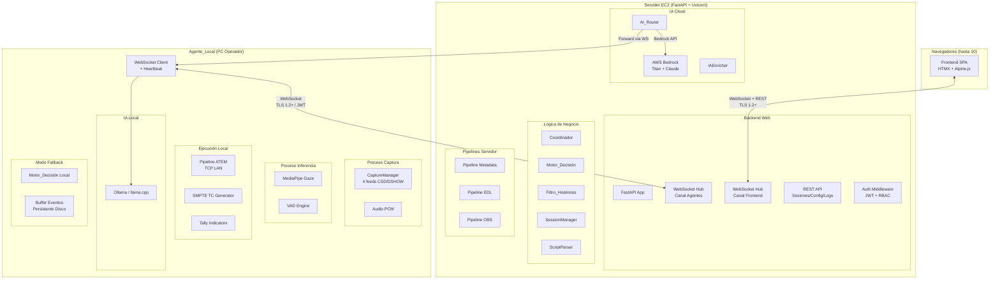
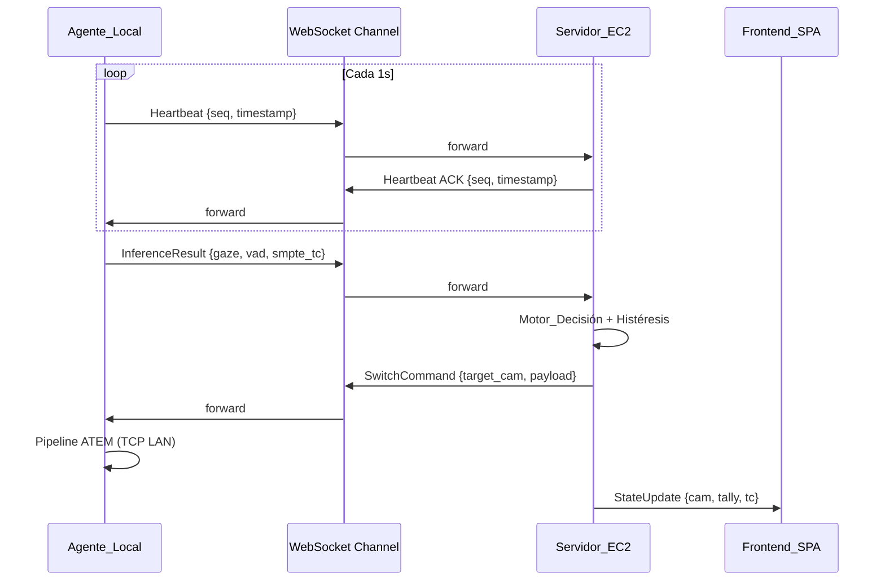
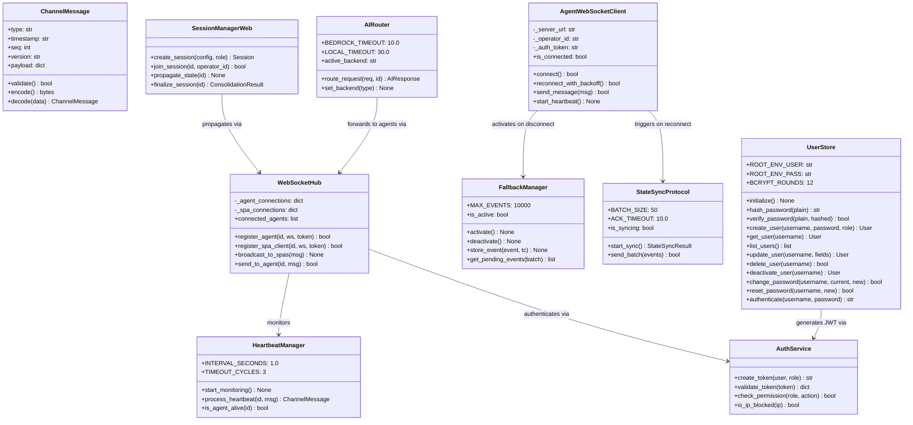

# Documento de Diseño Técnico — Web Migration

## Overview

La migración web de Switch_bot transforma el sistema de una aplicación de escritorio monolítica (Python, PyQt6, multiprocessing) a una arquitectura híbrida cliente-servidor desplegada en AWS EC2. El diseño divide el sistema en dos componentes distribuidos:

- **Servidor_EC2**: Proceso FastAPI que aloja el Coordinador, Motor_Decisión, Filtro_Histéresis, IAEnricher (modo Bedrock), Pipelines Metadata/EDL/OBS, SessionManager, ScriptParser, Backend Web (REST + WebSocket) y sirve el Frontend SPA.
- **Agente_Local**: Proceso autónomo en el PC del operador que ejecuta CaptureManager, InferenceEngine (MediaPipe), Pipeline ATEM, modelos locales de IA (Ollama/llama.cpp), VAD/Audio PCM y generación de timecodes SMPTE.

La comunicación bidireccional entre ambos se realiza mediante WebSocket persistente con protocolo JSON versionado, heartbeat cada 1s, detección de desconexión en 3s, y un protocolo State_Sync para reconciliación post-reconexión. El Frontend SPA reemplaza completamente la GUI PyQt6.

### Objetivos de Diseño

1. **Latencia sub-50ms**: Canal WebSocket con compresión per-message y serialización JSON optimizada
2. **Resiliencia ante desconexión**: Modo Fallback autónomo del agente + State_Sync no bloqueante
3. **Multi-operador**: Hasta 4 agentes + 10 clientes web simultáneos por sesión
4. **Compatibilidad total**: 605 tests existentes pasan sin modificaciones
5. **Seguridad**: JWT + TLS 1.2+ + RBAC + rate limiting
6. **Localidad de operaciones críticas**: Captura, inferencia y ATEM permanecen en hardware local

### Stack Tecnológico

| Componente | Tecnología |
|---|---|
| Lenguaje | Python 3.11+ |
| Backend Web | FastAPI + Uvicorn (ASGI) |
| WebSocket | fastapi.WebSocket + websockets |
| Frontend SPA | HTMX + Alpine.js (lightweight) |
| Comunicación | WebSocket (primario) / gRPC (alternativa) |
| Serialización | JSON (msgspec para rendimiento) |
| Compresión | per-message-deflate (WebSocket extension) |
| Autenticación | PyJWT + python-jose |
| TLS | Nginx reverse proxy (TLS termination) |
| Concurrencia Servidor | asyncio + uvloop |
| Concurrencia Agente | multiprocessing + asyncio + threading |
| IA Cloud | AWS Bedrock (boto3) |
| IA Local | Ollama / llama.cpp (en Agente_Local) |
| Visión | MediaPipe (Agente_Local) |
| Audio | WebRTC VAD (Agente_Local) |
| Switcher HW | PyAtemMax (Agente_Local, TCP LAN) |
| Persistencia | SQLite (sesiones) + filesystem (logs/EDL/DRP) |
| Testing | pytest + hypothesis + pytest-asyncio |

---

## Architecture

### Diagrama de Arquitectura de Alto Nivel



### Modelo de Comunicación



### Decisiones Arquitectónicas Clave

1. **WebSocket como canal primario**: Se elige WebSocket sobre gRPC como protocolo primario por simplicidad de despliegue (un solo puerto HTTP/HTTPS), compatibilidad nativa con navegadores (SPA), y latencia suficiente (<50ms) para el caso de uso. gRPC queda como alternativa documentada para escenarios de ultra-alto rendimiento.

2. **FastAPI como backend unificado**: Un solo proceso ASGI maneja REST + WebSocket + servido de estáticos (SPA). Uvicorn con uvloop provee event loop de alto rendimiento. Los routers de FastAPI aíslan responsabilidades sin overhead de microservicios.

3. **Separación de canales WebSocket**: Canal `/ws/agent/{operator_id}` para agentes y canal `/ws/spa/{client_id}` para frontends. Esto permite políticas de autenticación y rate-limiting diferenciadas.

4. **msgspec para serialización**: Reemplazo de `json.dumps/loads` estándar por `msgspec` que ofrece 5-10x mejor rendimiento en serialización/deserialización JSON, reduciendo latencia en el hot path de inferencia.

5. **HTMX + Alpine.js para el SPA**: Stack ligero que minimiza complejidad del frontend. HTMX maneja actualizaciones parciales del DOM via WebSocket, Alpine.js provee reactividad local. Sin build step ni bundler.

6. **Buffer persistente en disco (SQLite WAL)**: El buffer de eventos del Modo Fallback usa SQLite en modo WAL (Write-Ahead Log) para garantizar durabilidad ante reinicios del proceso sin sacrificar rendimiento de escritura.

7. **State_Sync no bloqueante**: La sincronización post-reconexión se ejecuta en un asyncio.Task independiente, enviando lotes de 50 eventos con ACK por lote, sin interferir con la operación en tiempo real.

8. **Nginx como TLS terminator**: Nginx delante de Uvicorn maneja TLS, compresión estática y WebSocket upgrade. Esto simplifica la configuración de certificados y permite HTTP/2 para REST.

---

## Components and Interfaces

### 1. ChannelMessage (Protocolo de Canal)

```python
import msgspec
from typing import Literal

class ChannelMessage(msgspec.Struct):
    """Mensaje del protocolo de comunicación bidireccional."""
    type: str                          # Tipo de mensaje (heartbeat, inference_result, switch_cmd, etc.)
    timestamp: str                     # ISO 8601 con ms precision
    seq: int                           # Unsigned 64-bit sequence number
    version: str                       # "MAJOR.MINOR" del protocolo
    payload: dict                      # Datos específicos del tipo de mensaje
    
    def validate(self) -> bool:
        """Valida campos obligatorios y tipos."""
        ...
    
    def encode(self) -> bytes:
        """Serializa a JSON bytes con msgspec."""
        return msgspec.json.encode(self)
    
    @classmethod
    def decode(cls, data: bytes) -> 'ChannelMessage':
        """Deserializa desde JSON bytes."""
        return msgspec.json.decode(data, type=cls)


# Tipos de mensaje definidos
MESSAGE_TYPES = Literal[
    "heartbeat",           # Heartbeat bidireccional
    "heartbeat_ack",       # Respuesta a heartbeat
    "inference_result",    # Agente → Servidor: resultados de inferencia
    "switch_command",      # Servidor → Agente: comando de conmutación
    "state_update",        # Servidor → SPA: actualización de estado
    "ai_request",          # Servidor → Agente: solicitud de IA local
    "ai_response",         # Agente → Servidor: respuesta de IA local
    "note_inject",         # SPA → Servidor: inyección de nota
    "panic_button",        # SPA → Servidor: activación panic
    "session_control",     # SPA → Servidor: control de sesión
    "state_sync_batch",    # Agente → Servidor: lote de State_Sync
    "state_sync_ack",      # Servidor → Agente: ACK de lote
    "error",               # Bidireccional: mensaje de error
]
```

### 2. WebSocketHub (Servidor)

```python
class WebSocketHub:
    """Gestor centralizado de conexiones WebSocket del servidor."""
    
    def __init__(self, max_agents: int = 4, max_spa_clients: int = 10):
        self._agent_connections: dict[str, WebSocket] = {}
        self._spa_connections: dict[str, WebSocket] = {}
        self._message_handlers: dict[str, Callable] = {}
    
    async def register_agent(self, operator_id: str, ws: WebSocket, token: str) -> bool:
        """Registra un Agente_Local tras validar JWT. Retorna False si auth falla."""
        ...
    
    async def register_spa_client(self, client_id: str, ws: WebSocket, token: str) -> bool:
        """Registra un cliente SPA tras validar JWT."""
        ...
    
    async def unregister_agent(self, operator_id: str) -> None:
        """Desregistra agente y notifica a SPAs conectados."""
        ...
    
    async def broadcast_to_spas(self, message: ChannelMessage) -> None:
        """Envía mensaje a todos los clientes SPA conectados."""
        ...
    
    async def send_to_agent(self, operator_id: str, message: ChannelMessage) -> bool:
        """Envía mensaje a un agente específico. Retorna False si no está conectado."""
        ...
    
    async def broadcast_to_agents(self, message: ChannelMessage) -> None:
        """Envía mensaje a todos los agentes conectados."""
        ...
    
    @property
    def connected_agents(self) -> list[str]:
        """IDs de agentes conectados actualmente."""
        ...
    
    @property
    def connected_spa_clients(self) -> list[str]:
        """IDs de clientes SPA conectados actualmente."""
        ...
```

### 3. HeartbeatManager

```python
class HeartbeatManager:
    """Gestiona heartbeats bidireccionales y detección de conectividad."""
    
    INTERVAL_SECONDS: float = 1.0
    TIMEOUT_CYCLES: int = 3          # 3 ciclos fallidos = desconexión
    SERVER_TIMEOUT_SECONDS: float = 5.0  # Servidor detecta en 5s
    
    def __init__(self, hub: WebSocketHub, on_disconnect: Callable):
        self._last_heartbeat: dict[str, datetime] = {}
        self._sequence_numbers: dict[str, int] = {}
        self._hub = hub
        self._on_disconnect = on_disconnect
    
    async def start_monitoring(self) -> None:
        """Inicia tarea periódica de verificación de heartbeats."""
        ...
    
    async def process_heartbeat(self, operator_id: str, msg: ChannelMessage) -> ChannelMessage:
        """Procesa heartbeat recibido y genera ACK con timestamp."""
        ...
    
    def is_agent_alive(self, operator_id: str) -> bool:
        """True si el agente ha respondido dentro del timeout."""
        ...
    
    def get_last_seen(self, operator_id: str) -> datetime | None:
        """Timestamp del último heartbeat válido recibido."""
        ...
```

### 4. AgentWebSocketClient (Agente Local)

```python
class AgentWebSocketClient:
    """Cliente WebSocket del Agente_Local con reconnection y heartbeat."""
    
    def __init__(self, server_url: str, operator_id: str, auth_token: str):
        self._server_url = server_url
        self._operator_id = operator_id
        self._auth_token = auth_token
        self._ws: WebSocket | None = None
        self._seq_counter: int = 0
        self._connected: bool = False
        self._heartbeat_task: asyncio.Task | None = None
        self._missed_heartbeats: int = 0
    
    async def connect(self) -> bool:
        """Establece conexión WebSocket con autenticación JWT."""
        ...
    
    async def reconnect_with_backoff(self) -> bool:
        """Reconexión con backoff exponencial (1s → 30s max, 20 intentos)."""
        ...
    
    async def send_message(self, msg: ChannelMessage) -> bool:
        """Envía mensaje. Si desconectado, encola en buffer local."""
        ...
    
    async def start_heartbeat(self) -> None:
        """Inicia heartbeat cada 1s. Detecta desconexión tras 3 fallos."""
        ...
    
    def on_heartbeat_timeout(self) -> None:
        """Callback invocado cuando se detectan 3 heartbeats fallidos."""
        ...
    
    @property
    def is_connected(self) -> bool: ...
    
    @property
    def missed_heartbeats(self) -> int: ...
```

### 5. FallbackManager (Agente Local)

```python
class FallbackManager:
    """Gestiona el Modo Fallback autónomo del Agente_Local."""
    
    MAX_EVENTS: int = 10_000
    MAX_DURATION_HOURS: int = 24
    
    def __init__(self, db_path: Path, local_decision_engine: 'LocalDecisionEngine'):
        self._db_path = db_path          # SQLite WAL para persistencia
        self._is_active: bool = False
        self._local_engine = local_decision_engine
        self._event_count: int = 0
    
    def activate(self) -> None:
        """Activa Modo Fallback. Inicia Motor_Decisión local."""
        ...
    
    def deactivate(self) -> None:
        """Desactiva Modo Fallback. Inicia State_Sync."""
        ...
    
    def store_event(self, event: dict, smpte_tc: str) -> None:
        """Almacena evento en buffer persistente. Descarta oldest si límite."""
        ...
    
    def get_pending_events(self, batch_size: int = 50) -> list[dict]:
        """Retorna lote de eventos pendientes de sincronización."""
        ...
    
    def mark_synced(self, event_ids: list[int]) -> None:
        """Marca eventos como sincronizados exitosamente."""
        ...
    
    @property
    def is_active(self) -> bool: ...
    
    @property
    def pending_count(self) -> int: ...
```

### 6. StateSyncProtocol

```python
class StateSyncProtocol:
    """Protocolo de sincronización post-reconexión."""
    
    BATCH_SIZE: int = 50
    ACK_TIMEOUT_SECONDS: float = 10.0
    MAX_RETRIES: int = 3
    
    def __init__(self, ws_client: AgentWebSocketClient, fallback: FallbackManager):
        self._ws_client = ws_client
        self._fallback = fallback
        self._syncing: bool = False
    
    async def start_sync(self) -> StateSyncResult:
        """Inicia sincronización en task independiente (no bloqueante)."""
        ...
    
    async def send_batch(self, events: list[dict]) -> bool:
        """Envía lote y espera ACK con timeout de 10s."""
        ...
    
    async def handle_ack(self, ack_msg: ChannelMessage) -> None:
        """Procesa ACK del servidor y marca eventos como sincronizados."""
        ...
    
    async def handle_conflict(self, conflicts: list[dict]) -> None:
        """Marca conflictos con flag CONFLICT para resolución manual."""
        ...
    
    @property
    def is_syncing(self) -> bool: ...
    
    @property
    def progress(self) -> tuple[int, int]:
        """(eventos sincronizados, total pendientes)."""
        ...
```

### 7. AIRouter (Servidor)

```python
class AIRouter:
    """Enruta solicitudes de IA a Bedrock (cloud) o Agente_Local (local)."""
    
    BEDROCK_TIMEOUT: float = 10.0
    LOCAL_TIMEOUT: float = 30.0
    
    def __init__(self, hub: WebSocketHub, bedrock_backend: 'BedrockBackend'):
        self._hub = hub
        self._bedrock = bedrock_backend
        self._active_backend: str = "bedrock"  # o "local"
    
    async def route_request(self, request: 'AIRequest', operator_id: str) -> 'AIResponse':
        """Enruta según backend activo. Aplica timeout correspondiente."""
        ...
    
    async def _process_bedrock(self, request: 'AIRequest') -> 'AIResponse':
        """Procesa con Bedrock directamente (timeout 10s)."""
        ...
    
    async def _forward_to_agent(self, request: 'AIRequest', operator_id: str) -> 'AIResponse':
        """Reenvía al agente vía WebSocket (timeout 30s)."""
        ...
    
    def set_backend(self, backend_type: str) -> None:
        """Configura el backend activo (solo antes de sesión o en idle)."""
        ...
    
    @property
    def active_backend(self) -> str: ...
```

### 8. SessionManager (Servidor — Extendido)

```python
class SessionManagerWeb(SessionManager):
    """Extiende SessionManager para multi-operador web."""
    
    PERSIST_INTERVAL_SECONDS: float = 5.0
    MAX_AGENTS: int = 8
    
    def __init__(self, hub: WebSocketHub, storage_path: Path):
        super().__init__()
        self._hub = hub
        self._storage_path = storage_path
        self._active_sessions: dict[str, Session] = {}
        self._persist_task: asyncio.Task | None = None
    
    async def create_session(self, config: dict, creator_role: str) -> Session:
        """Crea sesión con UUID v4. Solo rol 'director' puede crear."""
        ...
    
    async def join_session(self, session_id: str, operator_id: str) -> bool:
        """Agente se une a sesión activa. Max 8 agentes."""
        ...
    
    async def propagate_state(self, session_id: str) -> None:
        """Propaga estado a todos los conectados (agentes + SPAs) < 500ms."""
        ...
    
    async def handle_conflict(self, session_id: str, commands: list) -> dict:
        """Resuelve conflictos con first-write-wins."""
        ...
    
    async def finalize_session(self, session_id: str) -> ConsolidationResult:
        """Consolida logs/EDL/metadata. Retry 3x si falla."""
        ...
    
    async def recover_sessions(self) -> list[Session]:
        """Recupera sesiones activas post-reinicio (máx 5s pérdida)."""
        ...
```

### 9. AuthService (Servidor)

```python
class AuthService:
    """Servicio de autenticación y autorización JWT + RBAC."""
    
    TOKEN_EXPIRY_HOURS: int = 24
    MAX_LOGIN_ATTEMPTS: int = 5
    LOCKOUT_SECONDS: int = 60        # SPA lockout
    IP_BLOCK_SECONDS: int = 900      # 15 min IP block
    INACTIVITY_TIMEOUT_MINUTES: int = 30
    
    ROLES = {
        "operador": ["inject_note", "panic_button", "view_state"],
        "director": ["create_session", "finalize_session", "configure_ia", "download_artifacts"],
        "administrador": ["manage_users", "modify_roles", "security_logs"],
    }
    
    def create_token(self, user_id: str, role: str) -> str:
        """Genera JWT con expiración de 24h y claims de rol."""
        ...
    
    def validate_token(self, token: str) -> dict | None:
        """Valida JWT. Retorna claims si válido, None si inválido/expirado."""
        ...
    
    def check_permission(self, role: str, action: str) -> bool:
        """Verifica si el rol tiene permiso para la acción."""
        ...
    
    def record_failed_attempt(self, ip: str) -> bool:
        """Registra intento fallido. Retorna True si IP debe bloquearse."""
        ...
    
    def is_ip_blocked(self, ip: str) -> bool:
        """True si la IP está bloqueada por intentos fallidos."""
        ...
```

### 10. UserStore (Servidor — Gestión de Usuarios)

```python
import os
import sqlite3
from dataclasses import dataclass
from datetime import datetime, timezone
from pathlib import Path


class UserStore:
    """Almacenamiento persistente de usuarios con hashing seguro de contraseñas.

    Utiliza SQLite como backend. En el primer arranque (tabla vacía), crea el
    usuario root con credenciales de las variables de entorno
    SWITCHBOT_ROOT_USERNAME y SWITCHBOT_ROOT_PASSWORD.

    Dependencia de hashing: passlib[bcrypt] (por defecto, 12 rounds) o
    argon2-cffi (3 iteraciones) según configuración.
    """

    ROOT_ENV_USER: str = "SWITCHBOT_ROOT_USERNAME"
    ROOT_ENV_PASS: str = "SWITCHBOT_ROOT_PASSWORD"
    BCRYPT_ROUNDS: int = 12
    ARGON2_ITERATIONS: int = 3
    USERNAME_MIN_LEN: int = 3
    USERNAME_MAX_LEN: int = 64

    def __init__(self, db_path: Path, auth_service: 'AuthService', hash_backend: str = "bcrypt"):
        self._db_path = db_path
        self._auth_service = auth_service
        self._hash_backend = hash_backend  # "bcrypt" | "argon2"
        self._conn: sqlite3.Connection | None = None

    def initialize(self) -> None:
        """Crea tabla users si no existe. Si tabla vacía, crea usuario root."""
        ...

    def _create_root_user(self) -> None:
        """Lee SWITCHBOT_ROOT_USERNAME/PASSWORD del entorno y crea root.

        Raises:
            RuntimeError: Si las variables de entorno no están definidas.
        """
        ...

    # --- Hashing ---

    def hash_password(self, plain_password: str) -> str:
        """Hashea contraseña con bcrypt (12 rounds) o argon2 (3 iter)."""
        ...

    def verify_password(self, plain_password: str, hashed: str) -> bool:
        """Verifica contraseña contra hash almacenado. Timing-safe."""
        ...

    # --- CRUD ---

    def create_user(
        self,
        username: str,
        plain_password: str,
        role: str,
    ) -> 'User':
        """Crea usuario con validación de username y hash de password.

        Args:
            username: 3-64 caracteres alfanuméricos (validado con regex).
            plain_password: Contraseña en texto plano (se almacena hasheada).
            role: "operador" | "director" | "administrador".

        Raises:
            ValueError: Username inválido o duplicado.
            ValueError: Rol no permitido.
        """
        ...

    def get_user(self, username: str) -> 'User | None':
        """Retorna usuario por username o None si no existe."""
        ...

    def list_users(self) -> list['User']:
        """Retorna todos los usuarios (sin hashed_password en repr externa)."""
        ...

    def update_user(self, username: str, fields: dict) -> 'User':
        """Actualiza campos mutables del usuario (role, active).

        Raises:
            ValueError: Si el usuario no existe.
        """
        ...

    def delete_user(self, username: str) -> bool:
        """Elimina usuario. Rechaza eliminación del usuario root.

        Returns:
            True si se eliminó, False si no existe.

        Raises:
            PermissionError: Si se intenta eliminar al usuario root.
        """
        ...

    def deactivate_user(self, username: str) -> 'User':
        """Marca usuario como inactivo (active=False) sin eliminar registro.

        Raises:
            ValueError: Si el usuario no existe.
        """
        ...

    # --- Contraseñas ---

    def change_password(self, username: str, current_password: str, new_password: str) -> bool:
        """Cambia contraseña verificando la actual. Para uso propio del usuario.

        Returns:
            True si se cambió exitosamente.

        Raises:
            ValueError: Si la contraseña actual es incorrecta.
            ValueError: Si el usuario no existe.
        """
        ...

    def reset_password(self, username: str, new_password: str) -> bool:
        """Restablece contraseña sin verificar la anterior. Solo para administradores.

        Returns:
            True si se restableció exitosamente.

        Raises:
            ValueError: Si el usuario no existe.
        """
        ...

    # --- Login ---

    def authenticate(self, username: str, password: str) -> str | None:
        """Valida credenciales y retorna JWT si son válidas.

        Actualiza last_login del usuario. Integra con AuthService para
        generación de token.

        Returns:
            JWT string si credenciales válidas y usuario activo, None en caso contrario.
        """
        ...

    def update_last_login(self, username: str) -> None:
        """Actualiza campo last_login con timestamp actual ISO 8601."""
        ...

    @property
    def is_root_username(self) -> str:
        """Retorna el username del root (leído del env en init)."""
        ...
```

### 11. FastAPI Application Structure

```python
# main.py - Estructura de la aplicación FastAPI
from fastapi import FastAPI, WebSocket, Depends
from fastapi.staticfiles import StaticFiles

app = FastAPI(title="Switch_bot Server", version="1.0.0")

# Routers con separación de responsabilidades
app.include_router(auth_router, prefix="/api/auth", tags=["auth"])
app.include_router(users_router, prefix="/api/users", tags=["users"])
app.include_router(session_router, prefix="/api/sessions", tags=["sessions"])
app.include_router(config_router, prefix="/api/config", tags=["config"])
app.include_router(logs_router, prefix="/api/logs", tags=["logs"])
app.include_router(scripts_router, prefix="/api/scripts", tags=["scripts"])

# WebSocket endpoints
@app.websocket("/ws/agent/{operator_id}")
async def agent_websocket(ws: WebSocket, operator_id: str):
    """Canal dedicado para comunicación con Agentes_Locales."""
    ...

@app.websocket("/ws/spa/{client_id}")
async def spa_websocket(ws: WebSocket, client_id: str):
    """Canal dedicado para comunicación con Frontend_SPA."""
    ...

# Servido de estáticos (SPA)
app.mount("/", StaticFiles(directory="frontend/dist", html=True))
```

#### Endpoints de Autenticación y Usuarios (auth_router + users_router)

```python
from fastapi import APIRouter, Depends, HTTPException, Request
from fastapi.security import HTTPBearer

auth_router = APIRouter()
users_router = APIRouter()
security = HTTPBearer()


# --- Auth Router (/api/auth) ---

@auth_router.post("/login")
async def login(request: Request, body: LoginRequest) -> LoginResponse:
    """Valida credenciales (username + password) contra UserStore.

    - Si credenciales válidas y usuario activo → retorna JWT con claims {user_id, role}.
    - Si credenciales inválidas → 401 con mensaje genérico (no revela cuál campo falla).
    - Registra intentos fallidos con IP de origen.
    - Respeta rate-limiting de AuthService (5 intentos → bloqueo 60s).
    """
    ...


@auth_router.put("/password")
async def change_own_password(
    body: ChangePasswordRequest,
    current_user: dict = Depends(get_current_user),
) -> dict:
    """Cambia la contraseña del usuario autenticado.

    Requiere contraseña actual para verificación antes de aceptar la nueva.
    Almacena nueva contraseña hasheada reemplazando el hash anterior.
    """
    ...


# --- Users Router (/api/users) — Solo rol "administrador" ---

@users_router.get("/")
async def list_users(
    current_user: dict = Depends(require_admin),
) -> list[UserResponse]:
    """Lista todos los usuarios. No incluye hashed_password en respuesta."""
    ...


@users_router.post("/")
async def create_user(
    body: CreateUserRequest,
    current_user: dict = Depends(require_admin),
) -> UserResponse:
    """Crea usuario con username único (3-64 alfanuméricos), rol y contraseña.

    Campos creados: username, hashed_password, role, active=True,
    created_at=now(), last_login=None.
    """
    ...


@users_router.get("/{username}")
async def get_user(
    username: str,
    current_user: dict = Depends(require_admin),
) -> UserResponse:
    """Retorna datos de un usuario específico. Sin hash de contraseña."""
    ...


@users_router.put("/{username}")
async def update_user(
    username: str,
    body: UpdateUserRequest,
    current_user: dict = Depends(require_admin),
) -> UserResponse:
    """Actualiza campos del usuario (role, active). No permite cambiar username."""
    ...


@users_router.delete("/{username}")
async def delete_user(
    username: str,
    current_user: dict = Depends(require_admin),
) -> dict:
    """Elimina usuario. Rechaza eliminación del usuario root con 403.

    Raises:
        HTTPException 403: Si se intenta eliminar al usuario root.
        HTTPException 404: Si el usuario no existe.
    """
    ...


@users_router.put("/{username}/password")
async def admin_reset_password(
    username: str,
    body: ResetPasswordRequest,
    current_user: dict = Depends(require_admin),
) -> dict:
    """Restablece contraseña de otro usuario sin requerir la anterior.

    Solo accesible por administradores.
    """
    ...


# --- Request/Response schemas ---

class LoginRequest(msgspec.Struct):
    username: str
    password: str

class LoginResponse(msgspec.Struct):
    access_token: str
    token_type: str = "bearer"
    role: str
    username: str

class CreateUserRequest(msgspec.Struct):
    username: str               # 3-64 caracteres alfanuméricos
    password: str
    role: str                   # "operador" | "director" | "administrador"

class UpdateUserRequest(msgspec.Struct):
    role: str | None = None
    active: bool | None = None

class ChangePasswordRequest(msgspec.Struct):
    current_password: str
    new_password: str

class ResetPasswordRequest(msgspec.Struct):
    new_password: str

class UserResponse(msgspec.Struct):
    """Representación pública de usuario (sin hash de contraseña)."""
    id: int
    username: str
    role: str
    active: bool
    created_at: str
    last_login: str | None


# --- Dependencies ---

async def get_current_user(token: str = Depends(security)) -> dict:
    """Extrae y valida JWT. Retorna claims {user_id, role}."""
    ...

async def require_admin(current_user: dict = Depends(get_current_user)) -> dict:
    """Verifica que el usuario actual tiene rol 'administrador'.

    Raises:
        HTTPException 403: Si el rol no es administrador.
    """
    ...
```

### Interfaces entre Componentes (Diagrama)



---

## Data Models

### Protocolo de Mensajes

```python
# Tipos de payload por tipo de mensaje

class HeartbeatPayload(msgspec.Struct):
    """Payload para heartbeat y heartbeat_ack."""
    sender_timestamp: str       # ISO 8601 ms precision
    seq: int                    # Sequence number (uint64, monotonically increasing)


class InferenceResultPayload(msgspec.Struct):
    """Payload de resultado de inferencia (Agente → Servidor)."""
    gaze_x: float
    gaze_y: float
    gaze_target: str | None     # ID del personaje mirado
    landmarks: list[float]      # Landmarks faciales comprimidos
    vad_is_speaking: bool
    vad_speaker_id: str | None
    vad_start_tc: str | None    # SMPTE TC inicio actividad vocal
    vad_end_tc: str | None      # SMPTE TC fin actividad vocal
    smpte_tc: str               # TC actual del frame
    feed_index: int             # Índice de cámara fuente (0-3)


class SwitchCommandPayload(msgspec.Struct):
    """Payload de comando de conmutación (Servidor → Agente)."""
    target_cam: int             # Cámara destino (1-4)
    marker_type: str            # MarkerType como string
    note: str
    source_origin: str          # SourceOrigin como string
    smpte_tc: str


class StateUpdatePayload(msgspec.Struct):
    """Payload de actualización de estado (Servidor → SPA)."""
    active_cam: int
    tally_state: list[bool]     # [cam1_active, cam2_active, ...]
    current_tc: str             # SMPTE TC actual
    session_state: str          # created, started, paused, finalized
    panic_active: bool
    connected_agents: list[str]
    last_marker: dict | None    # Último marcador generado


class AIRequestPayload(msgspec.Struct):
    """Payload de solicitud de IA (Servidor → Agente para local)."""
    request_id: str
    operation: str              # "embeddings" | "analyze_context" | "similarity"
    texts: list[str] | None
    prompt: str | None
    context: str | None


class AIResponsePayload(msgspec.Struct):
    """Payload de respuesta de IA (Agente → Servidor)."""
    request_id: str
    success: bool
    embeddings: list[list[float]] | None
    analysis_result: str | None
    similarity_score: float | None
    error: str | None


class StateSyncBatchPayload(msgspec.Struct):
    """Payload de lote de State_Sync (Agente → Servidor)."""
    batch_id: int
    events: list[dict]          # Eventos con smpte_tc y datos
    total_pending: int
    tc_range_start: str         # Primer TC del lote
    tc_range_end: str           # Último TC del lote


class StateSyncAckPayload(msgspec.Struct):
    """Payload de ACK de State_Sync (Servidor → Agente)."""
    batch_id: int
    accepted: int               # Eventos aceptados
    conflicts: list[dict]       # Conflictos detectados (flag CONFLICT)
```

### Session Model

```python
@dataclass
class Session:
    """Modelo de sesión de producción."""
    id: str                             # UUID v4
    state: SessionState                  # created, started, paused, finalized
    created_at: str                      # ISO 8601
    creator_id: str
    config: SessionConfig
    participants: dict[str, ParticipantInfo]  # operator_id → info
    active_cam: int
    current_tc: str
    panic_active: bool
    event_log: list[dict]
    
    def transition(self, new_state: SessionState) -> bool:
        """Valida y ejecuta transición de estado."""
        ...


class SessionState(Enum):
    CREATED = "created"
    STARTED = "started"
    PAUSED = "paused"
    FINALIZED = "finalized"

# Transiciones válidas
VALID_TRANSITIONS = {
    SessionState.CREATED: [SessionState.STARTED],
    SessionState.STARTED: [SessionState.PAUSED, SessionState.FINALIZED],
    SessionState.PAUSED: [SessionState.STARTED, SessionState.FINALIZED],
    SessionState.FINALIZED: [],
}


class SessionConfig(msgspec.Struct):
    """Configuración de una sesión de producción."""
    video_mode: str
    fps: float
    ia_backend: str             # "bedrock" | "local"
    script_id: str | None
    primary_agent: str          # operator_id del agente primario


class ParticipantInfo(msgspec.Struct):
    """Información de un participante en la sesión."""
    operator_id: str
    role: str                   # "operador" | "director" | "administrador"
    connected: bool
    last_heartbeat: str | None
    hardware: dict | None       # Info del hardware local (ATEM IP, cámaras)
```

### User Model (Gestión de Usuarios — Requisito 16)

```python
from dataclasses import dataclass, field
from datetime import datetime, timezone


@dataclass
class User:
    """Modelo de usuario del sistema.

    Almacenado en SQLite (tabla 'users') con índice único en username.
    El campo hashed_password NUNCA se expone en respuestas REST.
    """
    id: int                         # Auto-increment SQLite (PRIMARY KEY)
    username: str                   # Único, 3-64 chars alfanuméricos [a-zA-Z0-9_-]
    hashed_password: str            # bcrypt hash (60 chars) o argon2 hash
    role: str                       # "operador" | "director" | "administrador"
    active: bool = True             # False = desactivado (no puede hacer login)
    created_at: str = ""            # ISO 8601 (se asigna en creación)
    last_login: str | None = None   # ISO 8601 o None si nunca ha hecho login

    def __post_init__(self) -> None:
        if not self.created_at:
            self.created_at = datetime.now(timezone.utc).isoformat()


# Esquema SQLite para la tabla users
USER_TABLE_SCHEMA = """
CREATE TABLE IF NOT EXISTS users (
    id            INTEGER PRIMARY KEY AUTOINCREMENT,
    username      TEXT    NOT NULL UNIQUE CHECK(length(username) BETWEEN 3 AND 64),
    hashed_password TEXT  NOT NULL,
    role          TEXT    NOT NULL CHECK(role IN ('operador', 'director', 'administrador')),
    active        INTEGER NOT NULL DEFAULT 1,
    created_at    TEXT    NOT NULL,
    last_login    TEXT
);

CREATE UNIQUE INDEX IF NOT EXISTS idx_users_username ON users(username);
"""

# Roles válidos del sistema
VALID_ROLES = ("operador", "director", "administrador")
```

### FallbackEvent (Buffer Persistente)

```python
@dataclass
class FallbackEvent:
    """Evento almacenado durante Modo Fallback."""
    id: int                     # Auto-increment SQLite
    smpte_tc: str               # TC original del evento
    event_type: str             # Tipo de evento
    payload: str                # JSON serializado del payload
    created_at: str             # ISO 8601 timestamp local
    synced: bool = False        # True cuando se transmitió al servidor
    sync_attempts: int = 0      # Intentos de transmisión
```

### Diagrama de Relaciones de Datos

```mermaid
erDiagram
    Session ||--|{ ParticipantInfo : has_participants
    Session ||--|| SessionConfig : configured_by
    Session ||--|{ FallbackEvent : accumulates_during_fallback
    
    ChannelMessage ||--|| HeartbeatPayload : "type=heartbeat"
    ChannelMessage ||--|| InferenceResultPayload : "type=inference_result"
    ChannelMessage ||--|| SwitchCommandPayload : "type=switch_command"
    ChannelMessage ||--|| StateUpdatePayload : "type=state_update"
    ChannelMessage ||--|| AIRequestPayload : "type=ai_request"
    ChannelMessage ||--|| AIResponsePayload : "type=ai_response"
    ChannelMessage ||--|| StateSyncBatchPayload : "type=state_sync_batch"
    ChannelMessage ||--|| StateSyncAckPayload : "type=state_sync_ack"
    
    WebSocketHub ||--|{ AgentConnection : manages
    WebSocketHub ||--|{ SPAConnection : manages
    AgentConnection ||--|| HeartbeatManager : monitored_by
    
    FallbackManager ||--|{ FallbackEvent : stores
    StateSyncProtocol ||--|{ FallbackEvent : transmits
    
    AIRouter ||--|| BedrockBackend : "backend=bedrock"
    AIRouter ||--|| AgentConnection : "backend=local, forwards to"
    
    AuthService ||--|{ JWTToken : issues
    JWTToken ||--|| UserRole : encodes

    UserStore ||--|{ User : manages
    UserStore ||--|| AuthService : "generates JWT via"
    User ||--o| JWTToken : "authenticates to get"
```



---


## Correctness Properties

*A property is a characteristic or behavior that should hold true across all valid executions of a system — essentially, a formal statement about what the system should do. Properties serve as the bridge between human-readable specifications and machine-verifiable correctness guarantees.*

### Property 1: Password hash round-trip

*For any* valid plaintext password, hashing it with `hash_password()` and then verifying with `verify_password(plain, hashed)` SHALL return True, and the hash string SHALL never contain the original plaintext as a substring.

**Validates: Requirements 16.2**

### Property 2: Username validation accepts only conforming inputs

*For any* string, `create_user()` SHALL accept it as username if and only if it matches the pattern `[a-zA-Z0-9_-]{3,64}`. Strings outside this pattern SHALL be rejected with ValueError, and the user store SHALL remain unchanged.

**Validates: Requirements 16.3**

### Property 3: Password hash never exposed in user retrieval

*For any* user created in the store, calling `get_user()` or `list_users()` and serializing the result to the external `UserResponse` representation SHALL never include the `hashed_password` field in the output.

**Validates: Requirements 16.4**

### Property 4: Root user is undeletable

*For any* sequence of `delete_user()` calls targeting the root username, the root user SHALL remain present in the store with its original role "administrador" and active status unchanged.

**Validates: Requirements 16.5**

### Property 5: Deactivation preserves user record

*For any* active user, calling `deactivate_user()` SHALL set `active=False` and the user SHALL remain retrievable from the store with all other fields (id, username, role, created_at) unchanged.

**Validates: Requirements 16.6**

### Property 6: Login authentication round-trip

*For any* user created with a known password and active=True, `authenticate(username, correct_password)` SHALL return a non-None JWT string, and `authenticate(username, wrong_password)` SHALL return None. For any user with active=False, `authenticate()` SHALL return None regardless of password correctness.

**Validates: Requirements 16.7, 16.8**

### Property 7: Password change round-trip

*For any* user with a known current password, after a successful `change_password(username, current, new)` or `reset_password(username, new)`, `verify_password(new, stored_hash)` SHALL return True and `verify_password(old, stored_hash)` SHALL return False. Additionally, `change_password()` with an incorrect current password SHALL fail without modifying the stored hash.

**Validates: Requirements 16.9, 16.10**

### Property 8: RBAC enforcement on user CRUD

*For any* authenticated user with role "operador" or "director", all user management operations (create, list, get, update, delete) SHALL be rejected with HTTP 403 Forbidden, and the user store SHALL remain unchanged.

**Validates: Requirements 16.11**

### Property 9: Username uniqueness constraint

*For any* username that already exists in the store, attempting to create a second user with the same username SHALL fail with an error, and the store SHALL contain exactly one user with that username.

**Validates: Requirements 16.12**

---

## Error Handling

### Errores de Autenticación y Usuarios (Requisito 16)

| Error | Código HTTP | Comportamiento |
|---|---|---|
| Credenciales inválidas (login) | 401 Unauthorized | Mensaje genérico "Credenciales inválidas" sin revelar campo incorrecto. Registra IP en log. |
| Token JWT ausente/inválido/expirado | 401 Unauthorized | Mensaje genérico sin revelar motivo específico. |
| Usuario inactivo intenta login | 401 Unauthorized | Mismo mensaje genérico que credenciales inválidas. |
| Rol insuficiente para CRUD de usuarios | 403 Forbidden | "Permisos insuficientes para esta operación." |
| Intento de eliminar usuario root | 403 Forbidden | "El usuario root no puede ser eliminado." |
| Username duplicado en creación | 409 Conflict | "El username ya existe." |
| Username con formato inválido | 422 Unprocessable Entity | "Username debe tener 3-64 caracteres alfanuméricos ([a-zA-Z0-9_-])." |
| Rol inválido en creación/actualización | 422 Unprocessable Entity | "Rol inválido. Valores permitidos: operador, director, administrador." |
| Contraseña actual incorrecta (change_password) | 400 Bad Request | "La contraseña actual es incorrecta." |
| Usuario no encontrado | 404 Not Found | "Usuario no encontrado." |
| Variables de entorno root ausentes (init) | RuntimeError (startup) | Log CRITICAL + fallo de arranque. El servidor no inicia sin credenciales root configuradas. |
| Rate-limiting (5 intentos fallidos) | 429 Too Many Requests | "Demasiados intentos. Intente nuevamente en 60 segundos." |
| IP bloqueada (15 min) | 403 Forbidden | "Acceso bloqueado temporalmente." |

### Estrategia de Errores

- Los errores de autenticación NUNCA revelan si el username existe o si la contraseña es incorrecta.
- Los errores de validación proporcionan mensajes descriptivos para el desarrollador del frontend.
- Los errores internos (SQLite corruption, hashing failure) se loguean como CRITICAL y retornan 500 genérico.
- Todas las operaciones fallidas de autenticación se registran con IP de origen y timestamp en el log de seguridad.

---

## Testing Strategy

### Dependencias de Testing para Requisito 16

- **pytest** + **pytest-asyncio**: Ejecución de tests async.
- **hypothesis**: Property-based testing (mínimo 100 iteraciones por propiedad).
- **httpx** (AsyncClient): Tests de endpoints FastAPI sin servidor real.
- **passlib[bcrypt]** o **argon2-cffi**: Dependencia de hashing de contraseñas.
  - Opción primaria: `passlib[bcrypt]` — ampliamente usada, compatible, 12 rounds por defecto.
  - Opción alternativa: `argon2-cffi` — más resistente a GPUs, 3 iteraciones configurables.
  - Se recomienda `passlib` con backend `bcrypt` por compatibilidad con la mayoría de despliegues.

### Property-Based Tests (Requisito 16)

Cada property test ejecuta un mínimo de **100 iteraciones** con generadores aleatorios.

| Property | Tag | Generadores |
|---|---|---|
| 1: Hash round-trip | `Feature: web-migration, Property 1: Password hash round-trip` | `text(min_size=1, max_size=128)` para passwords |
| 2: Username validation | `Feature: web-migration, Property 2: Username validation` | `text()` para strings arbitrarios + `from_regex(r'[a-zA-Z0-9_-]{3,64}')` para válidos |
| 3: No hash exposure | `Feature: web-migration, Property 3: No hash exposure` | Usuarios generados con campos aleatorios |
| 4: Root undeletable | `Feature: web-migration, Property 4: Root undeletable` | Secuencias aleatorias de operaciones delete |
| 5: Deactivation preserves | `Feature: web-migration, Property 5: Deactivation preserves` | Usuarios aleatorios con campos variados |
| 6: Login round-trip | `Feature: web-migration, Property 6: Login round-trip` | Passwords aleatorios + mutaciones para "wrong" |
| 7: Password change round-trip | `Feature: web-migration, Property 7: Password change round-trip` | Pares (old_password, new_password) aleatorios |
| 8: RBAC enforcement | `Feature: web-migration, Property 8: RBAC enforcement` | Roles no-admin + operaciones CRUD aleatorias |
| 9: Username uniqueness | `Feature: web-migration, Property 9: Username uniqueness` | Usernames válidos duplicados |

### Unit Tests (Requisito 16)

- **test_user_store_init_creates_root**: Verifica creación de root en primera ejecución con env vars.
- **test_user_store_init_no_env_vars_fails**: Verifica fallo si SWITCHBOT_ROOT_USERNAME/PASSWORD no definidos.
- **test_login_returns_jwt_with_correct_claims**: Verifica estructura del JWT (user_id, role, exp).
- **test_login_updates_last_login**: Verifica que last_login se actualiza tras login exitoso.
- **test_login_generic_error_for_all_failure_modes**: Verifica mismo mensaje para user inexistente, password incorrecta, y user inactivo.
- **test_deactivated_user_cannot_login**: Verifica que active=False impide autenticación.
- **test_delete_nonexistent_user_returns_404**: Verifica manejo de usuario no encontrado.

### Integration Tests (Requisito 16)

- **test_full_login_flow_e2e**: Init → create user → login → use JWT in protected endpoint → change password → re-login.
- **test_admin_user_lifecycle**: Create → get → update role → deactivate → verify cannot login → admin reset password → reactivate → verify can login.
- **test_rate_limiting_blocks_after_5_failures**: 5 intentos fallidos → siguiente retorna 429/403.
- **test_concurrent_user_creation_same_username**: Verifica que solo una creación tiene éxito bajo concurrencia.
